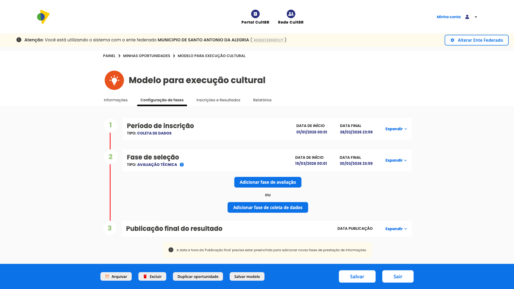
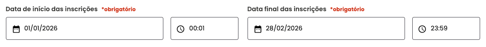
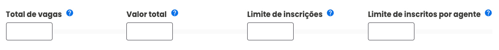
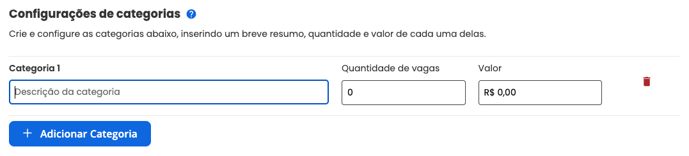
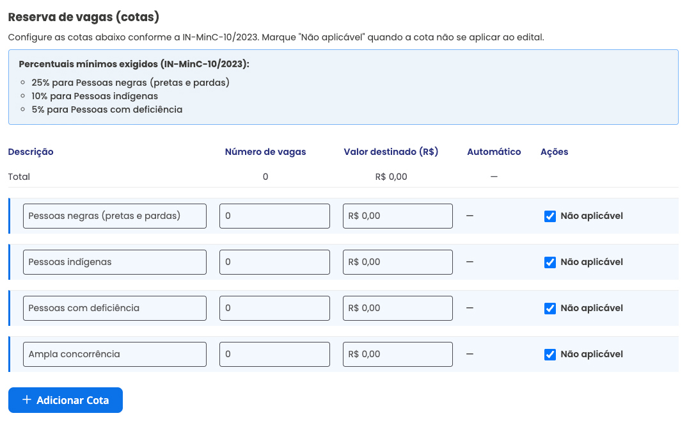
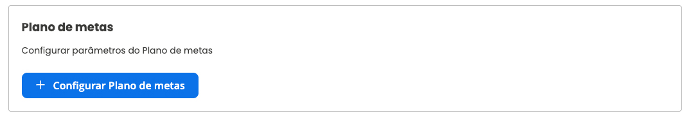

## Configuração das fases da oportunidade

Depois de preencher a aba **Informações** em [Gerenciar Oportunidades](./gerenciar-oportunidades), o próximo passo é acessar **Configuração de Fases**.

É nessa aba que o gestor organiza o fluxo da oportunidade, definindo como ela vai funcionar desde a inscrição até as etapas de avaliação, resultados e coleta de dados.

Aqui você pode:

- configurar a fase de inscrição
- definir parâmetros e categorias da seleção
- estabelecer tipos de proponente
- configurar categorias da oportunidade
- adicionar fases de avaliação e coleta de dados
- montar e ajustar o formulário de inscrição
- habilitar recurso, quando necessário

> A numeração lateral da tela se ajusta automaticamente conforme a quantidade de fases adicionadas à oportunidade.

---

## Fase de inscrição

A fase de inscrição reúne as principais configurações para que os proponentes possam acessar a oportunidade, preencher o formulário e enviar a candidatura.

Ao clicar em **Expandir** na fase de inscrição, a plataforma exibe os blocos de configuração disponíveis:

### Período de inscrição

Nesse bloco, a fase aparece como **Tipo: Coleta de dados** e reúne as principais definições de período da inscrição.

Revise com atenção os campos obrigatórios:

- **Data de início das inscrições**
- **Data final das inscrições**

Em cada um deles, a plataforma permite informar:

- data
- horário

As datas e horários podem vir preenchidos a partir da criação da oportunidade, mas podem ser ajustados aqui.

### Tipos de proponente

Nesse campo, você define quais tipos de proponente poderão participar do edital.

É possível selecionar uma ou mais opções:

- **Pessoa Física**
- **MEI**
- **Coletivo**
- **Pessoa Jurídica**

### Parâmetros da oportunidade

Os parâmetros ajudam a controlar o funcionamento da inscrição.

Entre os campos disponíveis, estão:

- **Total de vagas**: é a quantidade máxima de vagas disponíveis no edital ou na oportunidade.
- **Valor total**: representa o montante máximo de recursos financeiros disponíveis para o edital ou para a oportunidade.
- **Limite de inscrições**: indica o número máximo de pessoas que poderão se inscrever no edital. Quando esse limite é atingido, as inscrições são encerradas, mesmo que o período de inscrição ainda não tenha terminado.
- **Limite de inscrições por agente**: indica o número máximo de inscrições que cada agente poderá ter no edital. Quando esse limite é atingido, o agente não poderá efetuar novas inscrições nessa oportunidade.

> Observação: os limites de inscrições e de inscrições por agente são flexíveis. Se não houver um número máximo definido, a plataforma não aplicará bloqueio. Caso contrário, as inscrições seguirão o limite estabelecido.

### Configurações de categorias

Nesse bloco, você cria e configura as categorias da oportunidade, inserindo um breve resumo, a quantidade de vagas e o valor de cada categoria.

Para cada categoria, você pode informar:

- nome da categoria
- quantidade de vagas
- valor destinado

Se necessário, clique em **Adicionar Categoria** para criar outras categorias.

### Reserva de vagas (cotas)

Neste bloco, você configura a reserva de vagas conforme a **IN-MinC-10/2023**.

Marque **Não aplicável** quando a cota não se aplicar ao edital.

Os percentuais mínimos exigidos são:

- **25% para Pessoas negras (pretas e pardas)**
- **10% para Pessoas indígenas**
- **5% para Pessoas com deficiência**

Para cada grupo, a plataforma permite configurar:

- descrição
- número de vagas
- valor destinado
- ações disponíveis

Os grupos exibidos na configuração incluem:

- **Pessoas negras (pretas e pardas)**
- **Pessoas indígenas**
- **Pessoas com deficiência**
- **Ampla concorrência**

Se necessário, clique em **Adicionar Cota** para incluir novas configurações.

---

## Configurar formulário

O bloco **Configurar formulário** define quais informações e documentos serão solicitados dos proponentes durante a inscrição.

Com ele, você pode:

- criar campos personalizados
- solicitar documentos obrigatórios
- incluir perguntas objetivas e discursivas
- organizar o formulário em etapas

### Importar formulário

Se você já usou um formulário semelhante em outra oportunidade, pode reaproveitá-lo pela opção **Importar Formulário**.

Depois da importação, os campos continuam editáveis.

### Exportar e importar de outra oportunidade

Para reaproveitar um formulário de outra oportunidade:

1. Acesse a oportunidade de origem.
2. Vá até `Configuração de Fases > Período de Inscrição > Configurar Formulário`.
3. Exporte o arquivo do formulário.
4. Volte à nova oportunidade e use a opção **Importar**.

O sistema gera um arquivo no formato `opportunity-XXXX-fields.txt`.

### Campos opcionais do formulário

Além dos campos criados manualmente, a plataforma permite habilitar alguns campos prontos.

#### Vínculo de espaço

Permite que o proponente associe a inscrição a um espaço cultural cadastrado.

Opções:

- **Desabilitado**
- **Obrigatório**
- **Opcional**

#### Nome do projeto

Permite que o proponente informe um nome para a proposta inscrita.

Opções:

- **Desabilitado**
- **Obrigatório**
- **Opcional**

#### Imagem de perfil

Permite solicitar uma imagem de perfil durante a inscrição.

Opções:

- **Desabilitado**
- **Habilitado**

#### Pergunta sobre cotas

Permite incluir no formulário a pergunta **“Vai concorrer às cotas?”**, quando a seleção adotar ações afirmativas.

Opções:

- **Desabilitado**
- **Habilitado**

---

## Etapas e campos do formulário

O formulário de inscrição pode ser organizado em etapas, o que ajuda a estruturar melhor o preenchimento e a leitura pelos avaliadores.

### Etapas

As etapas funcionam como blocos do formulário, agrupando perguntas por assunto.

Exemplos comuns:

- dados pessoais
- descrição da proposta
- documentação
- informações complementares

As etapas podem ser criadas, editadas, reordenadas ou removidas conforme a necessidade da oportunidade.

### Campos

Os campos são os itens preenchidos dentro de cada etapa do formulário.

Eles podem ser usados para coletar:

- textos curtos e longos
- números e valores
- datas
- documentos
- links
- opções de seleção
- dados de pessoas, agentes e espaços

### Síntese dos campos disponíveis

Na configuração do formulário, há diversos tipos de campos disponíveis para personalizar a inscrição e coletar as informações necessárias dos proponentes.

#### Organização e identificação

- `#` **Título de Seção**
- `@` **Campo do Agente Coletivo**
- `@` **Campo do Agente Responsável**
- `@` **Campo do Espaço**

#### Campos de seleção

- **Caixa de Verificação (Checkbox)**
- **Seleção Única**
- **Seleção Múltipla**

#### Dados pessoais e jurídicos

- **Campo de CPF**
- **Campo de CNPJ**
- **Campo de E-mail**
- **Campo de Telefone do Brasil**
- **Campo de Data**
- **Seleção de Município**

#### Campos digitais e de conteúdo

- **Campo de URL (Link)**
- **Campo de Listagem de Links**
- **Campo de Listagem de Endereços**
- **Campo de Listagem de Pessoas**

#### Financeiro e logístico

- **Campo de Moeda (R$)**
- **Campo Numérico**
- **Campo de Dados Bancários**

#### Descrição e texto

- **Campo de Texto Simples**
- **Campo de Texto (Textarea)**

### Adicionar campo

Para inserir um novo campo, clique em **Adicionar campo**.

Ao adicionar um campo, a plataforma abre uma caixa de configuração com os itens principais:

- **Nome do campo**
- **Descrição do campo**
- **Tipo de campo**
- **Obrigatoriedade**
- **Definição por tipo de proponente**

---

## Plano de metas

Se a oportunidade exigir o acompanhamento de metas e entregas, você pode habilitar e configurar o **Plano de Metas** ainda na fase de inscrição.

Ao clicar em **Configurar Plano de Metas**, a plataforma exibe a área de configuração:

Nesse bloco, você pode definir:

- duração máxima do projeto
- metas
- entregas vinculadas a cada meta
- limites de preenchimento

Esse recurso ajuda a estruturar melhor a execução das propostas e facilita o acompanhamento posterior.

### Publicação de resultados na fase de inscrição

A fase de inscrição também pode ter configuração de publicação de resultados.

Entre as opções disponíveis, estão:

- data e hora de publicação
- publicação automática
- publicação manual

---

## Adicionar fase de avaliação

Depois da inscrição, você pode criar uma ou mais fases de avaliação, conforme o regulamento da oportunidade.

Clique em **Adicionar fase de avaliação**:

Ao fazer isso, a plataforma abre a tela de configuração da nova fase:

Nessa etapa, você define:

- o tipo de avaliação
- o nome da fase
- a data de início
- a data de término

Depois da criação, clique em **Expandir** para configurar os detalhes da fase:

### Tipos de avaliação

A plataforma disponibiliza quatro tipos principais de avaliação:

#### Avaliação de documentação

Usada para verificar a presença dos documentos exigidos.

#### Habilitação documental

Usada para analisar se os documentos atendem aos critérios e exigências do edital.

#### Avaliação simplificada

Indicada para processos mais objetivos, com menor detalhamento técnico.

#### Avaliação técnica

Indicada para oportunidades que exigem análise de mérito, critérios de pontuação e pareceres mais detalhados.

### Estrutura geral das avaliações

Alguns campos são comuns aos diferentes tipos de avaliação.

### Título e período da avaliação

Nesse bloco, o gestor define o nome da fase e o intervalo em que ela ficará aberta para análise.

### Comissão de avaliação

Aqui você configura as comissões e os avaliadores responsáveis pela análise.

Entre as ações disponíveis, estão:

- adicionar comissão
- nomear comissão
- limitar número de avaliadores por inscrição
- configurar filtros de distribuição
- adicionar pessoa avaliadora
- excluir comissão

### Campos visíveis para avaliadores

Esse bloco define quais informações do formulário ficarão visíveis para os avaliadores.

### Textos explicativos da avaliação

Você pode adicionar orientações gerais para as pessoas avaliadoras.

### Publicação dos resultados da avaliação

As fases de avaliação permitem configurar a publicação dos resultados, inclusive com opções de automação.

Entre os itens disponíveis, estão:

- data e hora de publicação
- publicação automática
- publicação dos pareceres para o proponente
- publicação do nome dos avaliadores nos pareceres
- autoaplicação de resultados

### Recurso na fase de avaliação

Se a fase permitir recurso, defina o e-mail de destino para recebimento.

### Configurações específicas da avaliação técnica

Algumas opções aparecem apenas em avaliações mais detalhadas, especialmente na **Avaliação Técnica**.

#### Critérios de avaliação

É possível criar seções de critérios, organizar pesos e definir regras da análise.

Os principais itens incluem:

- nome da seção
- exclusão da seção
- limite de critérios não eliminatórios
- configuração de filtro
- parecer obrigatório por seção

#### Exequibilidade

Esse critério ajuda a avaliar se a proposta é viável dentro das condições apresentadas.

#### Critérios de desempate

Você pode configurar critérios para ordenar inscrições com a mesma pontuação final.

Exemplos de desempate:

- maior nota em critério específico
- ordem de inscrição
- critérios de ações afirmativas

#### Políticas afirmativas

Esse bloco permite configurar cotas, distribuição territorial de vagas e bônus de pontuação.

Antes de habilitar essas opções, confira se o total de vagas foi definido na fase de inscrição.

Você pode configurar:

- cotas
- distribuição de vagas por território
- bônus de pontuação

---

## Fase de coleta de dados

Se a oportunidade precisar solicitar informações adicionais depois da inscrição, você pode adicionar uma **Fase de Coleta de Dados**.

Ao configurar essa fase, a plataforma apresenta os itens principais:

Você pode definir:

- nome da fase
- período da coleta
- formulário próprio
- recurso
- publicação de resultados

Essa fase é útil para complementar dados, pedir documentos extras ou confirmar informações antes da decisão final.

---

## Publicação do resultado final

Ao fim do processo seletivo, a plataforma permite configurar a fase de **Publicação Final do Resultado**.

Nessa etapa, você pode definir:

- data de publicação
- publicação automática ou manual
- possibilidade de recurso
- e-mail de destino para recursos

---

## Próxima etapa do fluxo

Depois de configurar as fases da oportunidade, siga para a página [Inscrições e Resultados](./inscricoes-resultados), onde você acompanha o andamento das inscrições, avaliações e publicações dentro da plataforma.
