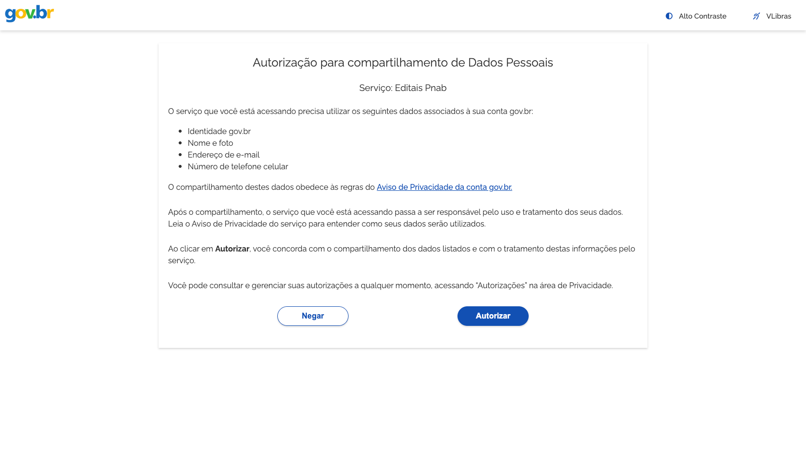
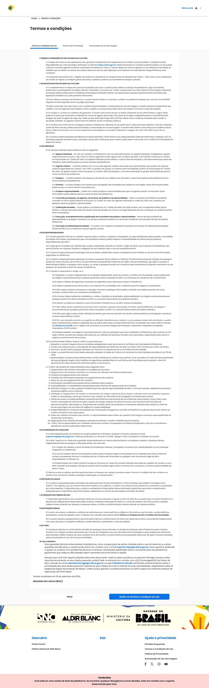
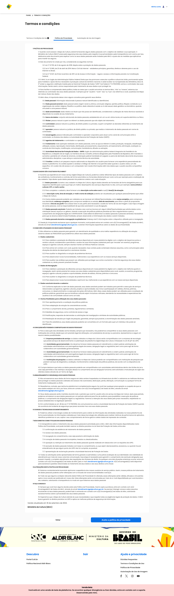
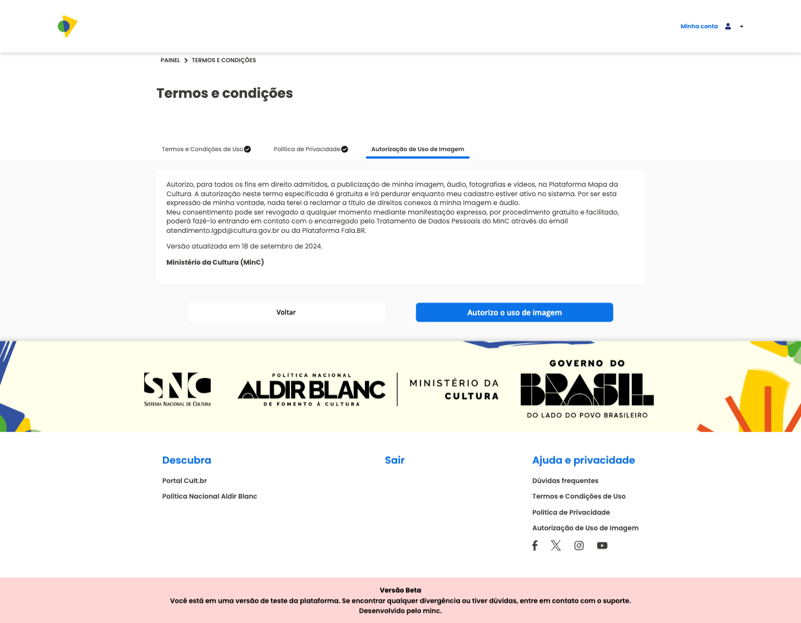
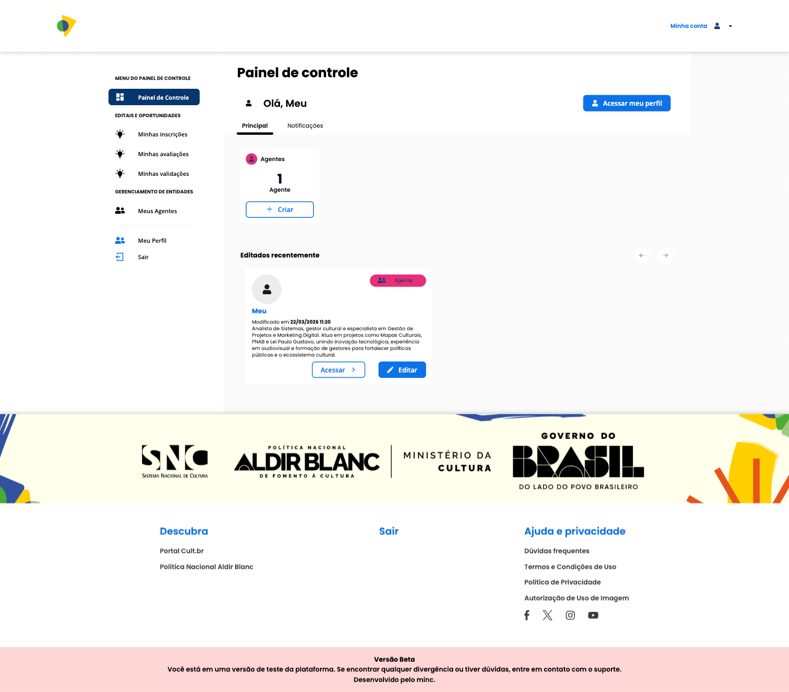

## Como criar uma conta?

Para acessar todas as funcionalidades do Cult Editais como gestor, é necessário criar uma conta com o seu login **gov.br**.

1. Clique em **Entrar**.

2. Clique em **Entrar com Gov.br**.

3. Preencha o CPF e a senha para fazer login no gov.br.

4. Autorize o compartilhamento dos seus dados com a plataforma.

5. Preencha as informações do seu perfil.

6. Clique em **Salvar e continuar**.

7. Leia e aceite os **Termos e Condições de Uso**.

8. Leia e aceite a **Política de Privacidade**.

9. Leia e aceite a **Autorização de Uso de Imagem**.

---

## Painel de Controle

Para acessar o Painel de Controle, clique no ícone **"Minha Conta"** no canto superior direito da tela.

Ao acessá-lo, você será direcionado ao painel de controle, onde pode gerenciar de forma rápida e prática todas as informações relacionadas ao seu perfil e às oportunidades que administra.

### Conta e Privacidade

Nesta seção é possível alterar informações de **e-mail e senha**.
