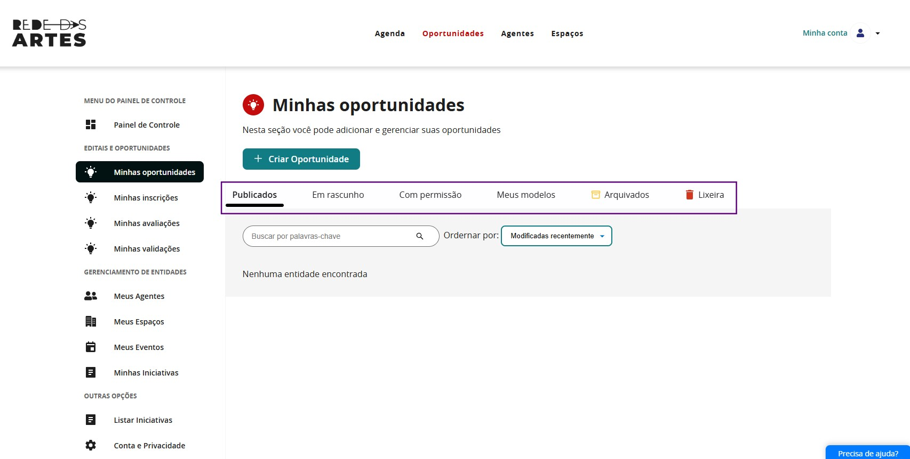
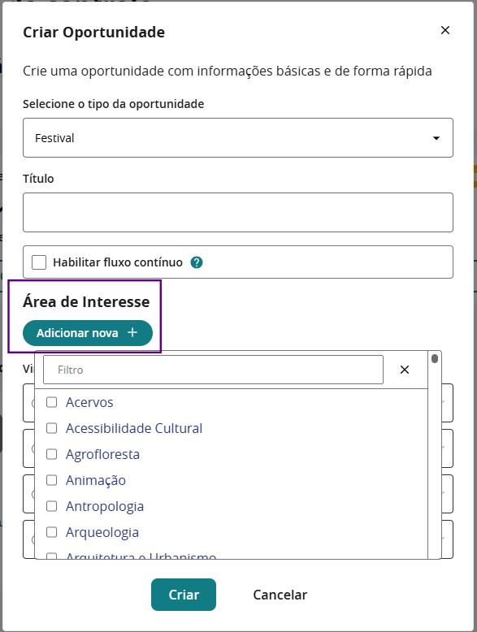

## Painel de Controle

O **Painel de Controle** é o centro de comando do módulo do gestor, oferecendo uma visão consolidada de todas as atividades e acesso rápido às principais funcionalidades.

## Visão Geral

A primeira informação importante é compreender as **informações disponíveis no Painel de Controle** da plataforma: 

Aqui você verá em destaque em verde o **“+ criar oportunidade”** e, abaixo, abas com os itens:

- **publicados**
- **em rascunho**
- **com permissão**
- **meus modelos**
- **arquivados**
- **lixeira**

## Criar uma oportunidade

No painel, clique em **+ Criar oportunidade**.

A primeira ação necessária é definir o **tipo de oportunidade** que você irá criar.  
Há muitas opções disponíveis para criar uma oportunidade na plataforma:

---

## Áreas de Interesse

Categorize a oportunidade dentro das áreas culturais para facilitar a busca pelos proponentes. Clique em **adicionar nova** e selecione uma ou mais áreas de interesse.

## Entidade Vinculada

Vincule a oportunidade a um agente, espaço, evento ou iniciativa já cadastrada na plataforma. Caso a entidade ainda não esteja cadastrada, crie-a antes de prosseguir.

Depois de preencher todas as informações, clique em **Criar**:

E você receberá a seguinte mensagem:

A oportunidade é criada em modo **rascunho**. A partir daqui, acesse-a para preencher todas as configurações antes de publicar.
