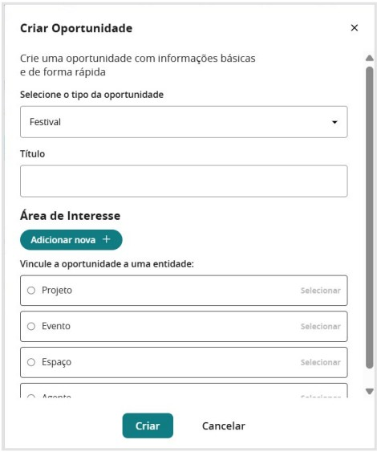
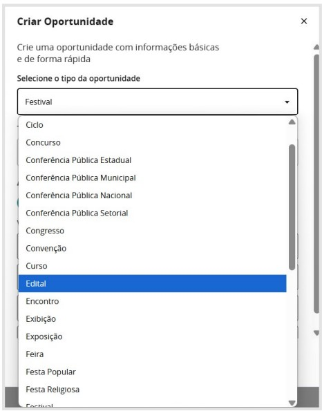
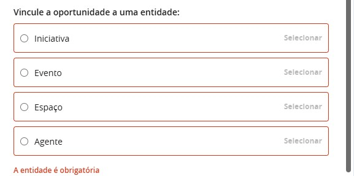
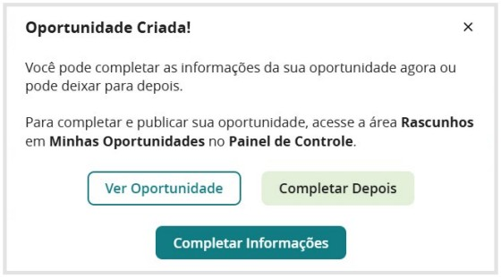

## Painel de Controle

Para acessar a criação de oportunidades, o gestor deve clicar em **Painel de Controle** no menu principal. Na seção **Ente Federado**, clique em **Oportunidades**.

## Minhas Oportunidades

Ao acessar a seção de Oportunidades, você verá a tela **Minhas Oportunidades**, com o botão **+ Criar oportunidade** em destaque e as seguintes abas de organização:

- **Publicados** — oportunidades ativas e visíveis ao público, abertas para inscrição conforme o período configurado.
- **Em rascunho** — oportunidades criadas mas ainda não publicadas. Ficam aqui até que o gestor finalize todas as configurações e decida publicar.
- **Com permissão** — oportunidades de outros gestores às quais você foi adicionado como administrador ou colaborador.
- **Meus modelos** — oportunidades salvas como modelo para reaproveitamento em futuras chamadas públicas.
- **Arquivados** — oportunidades encerradas ou desativadas que foram movidas para arquivo. Não aparecem na listagem pública, mas podem ser consultadas.
- **Lixeira** — oportunidades excluídas. Podem ser recuperadas enquanto não forem deletadas permanentemente.

## Criar uma oportunidade

### Usando um modelo PNAB (recomendado)

Antes de criar uma oportunidade do zero, verifique a aba **Meus Modelos**. A plataforma disponibiliza modelos oficiais da **Política Nacional Aldir Blanc** cobrindo **todos os tipos de editais previstos pela PNAB** — Fomento, Premiação, Credenciamento, Habilitação, entre outros — com todo o fluxo já estruturado: fases de inscrição, avaliação, coleta de dados, publicação de resultados e formulários pré-configurados.

Ao usar um modelo, o gestor precisa configurar apenas:

- **Datas** de cada fase (inscrição, avaliação, publicação de resultados)
- **Imagens** e identidade visual da chamada pública
- **Anexos** (regulamento, edital, materiais de apoio)
- **Pareceristas** e comissões de avaliação

Isso reduz significativamente o tempo de configuração e garante que o fluxo esteja alinhado com as diretrizes da PNAB.

Na aba **Meus Modelos**, localize o modelo correspondente ao tipo de edital desejado e clique em **Usar esse modelo**.

Será aberto o modal **Configurações da nova oportunidade**. Preencha os campos obrigatórios:

- **Exercício** — selecione o ano de execução (ex.: 2026)
- **Meta**, **Ação** e **Atividade** — vincule ao instrumento correto dentro do seu PAR
- **Título** — nome da chamada pública
- **Descrição curta** — resumo em até 400 caracteres

Após preencher, clique em **Começar**.

A oportunidade será criada em modo **rascunho** e você será redirecionado automaticamente para a tela de configuração, onde poderá preencher todas as informações da chamada pública.

Para saber como configurar cada seção da oportunidade, consulte [Gerenciar Oportunidades](/docs/gestor/gerenciar-oportunidades).

---

### Criando manualmente

Caso prefira criar uma oportunidade do zero, clique em **+ Criar oportunidade**.

A primeira ação necessária é definir o **tipo de oportunidade** que você irá criar.  
Há muitas opções disponíveis para criar uma oportunidade na plataforma:

---

## Áreas de Interesse

Categorize a oportunidade dentro das áreas culturais para facilitar a busca pelos proponentes. Clique em **adicionar nova** e selecione uma ou mais áreas de interesse.

## Entidade Vinculada

Vincule a oportunidade a um agente, espaço, evento ou iniciativa já cadastrada na plataforma. Caso a entidade ainda não esteja cadastrada, crie-a antes de prosseguir.

Depois de preencher todas as informações, clique em **Criar**:

E você receberá a seguinte mensagem:

A oportunidade é criada em modo **rascunho**. A partir daqui, acesse-a para preencher todas as configurações antes de publicar.
