## 3. Gerenciando uma oportunidade / chamada pública criada

Para gerenciar uma oportunidade criada, é importante que ela tenha sido inicialmente criada (consulte o item 1 para saber como criar).

Agora, será necessário configurá-la.

Você pode visualizá-la diretamente no pop-up de criação em **“completar informações”** ou acessá-la no **Painel de Controle**, na seção **“Oportunidades em Rascunho”**, conforme detalhamento abaixo.

> Observe que a **Oportunidade** está na aba **“rascunho”**, ou seja, ainda não foi publicada.

- Há duas opções em todas as oportunidades: 

Você pode **acessar as informações** ou **editar as informações**.

1. Ao clicar em **“Editar”**, você será direcionado para o gerenciamento da oportunidade.  
2. Ao clicar em **“Acessar”**, você encontrará a seguinte tela, que é a visualização de como ficará a chamada pública:

Para editar a partir da página da oportunidade criada, você deverá clicar em **“gerenciar oportunidade”**.

> A seguir, explicamos como a Plataforma organiza as Oportunidades.

## 3.1 Como está organizada a Rede das Artes em Oportunidades

Antes de abordarmos diretamente o gerenciamento de editais na plataforma, é fundamental compreender como ela está organizada.

A Rede das Artes estrutura a criação e o gerenciamento de oportunidades de forma organizada, permitindo que usuários configurem editais e processos seletivos.

Para isso, a plataforma está dividida em três níveis principais:

A seguir, explicamos detalhadamente cada um desses elementos.

---

### 1 - Abas

As abas são as divisões principais dentro da página de gerenciamento de oportunidades. Elas funcionam como áreas de navegação, permitindo que o usuário acesse diferentes conjuntos de configurações.

Na Rede das Artes, o gerenciamento das oportunidades é organizado em quatro abas principais, que facilitam a configuração e acompanhamento da chamada pública:

1. **Aba “Informações”**  
Área onde são cadastradas as principais informações da oportunidade, como nome, descrição, datas, entidade vinculada, regulamentos e anexos.

2. **Aba “Configuração de Fases”**  
Permite configurar as fases da chamada pública, como inscrição, avaliações e publicação dos resultados.

3. **Aba “Inscrições e Resultados”**  
Área em que são gerenciadas e acompanhadas as inscrições, as avaliações e publicação do resultado.

4. **Aba “Relatórios”**  
Área destinada à análise de dados da oportunidade, permitindo a geração de relatórios sobre inscritos, selecionados e demais métricas.

---

## Rodapé da Oportunidade

No gerenciamento da Oportunidade haverá sempre o **rodapé de ações rápidas** que facilita o gerenciamento. Confira suas funções:

1. **Arquivar**  
Move a oportunidade para um estado inativo, retirando-a da listagem pública sem excluí-la permanentemente.

2. **Excluir**  
Remove a oportunidade de forma definitiva. A oportunidade ficará na lixeira.

3. **Duplicar Oportunidade**  
Cria uma cópia idêntica da oportunidade, útil para reaproveitar oportunidades anteriores.

4. **Salvar Modelo**  
Permite salvar a estrutura da oportunidade como um modelo, facilitando a criação de novas oportunidades similares no futuro.

5. **Sair**  
Sai da tela de edição sem salvar alterações recentes.

6. **Salvar**  
Armazena as edições feitas.

7. **Salvar e Publicar**  
Finaliza o cadastro e torna a oportunidade visível ao público, permitindo inscrições conforme o período definido.

---

## 2 - Seções ou blocos de configuração

Dentro de cada aba, há grupos específicos de configurações organizados por temas. Esses grupos são chamados de **“seções”**, algumas seções possuem um único **“bloco de configuração”**, pois reúnem itens relacionados dentro de uma mesma categoria.

Por exemplo, dentro da aba **“Informações”**, há o seguinte bloco de informações de data dentro da seção de **“informações obrigatórias”**:

---

## 3 - Campos ou Itens de Configuração

Cada seção contém elementos interativos onde o usuário insere ou seleciona informações.  
Esses elementos são chamados de **“campos”**, **“itens de configuração”** ou **“opções de configuração”**.

No exemplo abaixo, os campos são os quadros para inserção das informações:

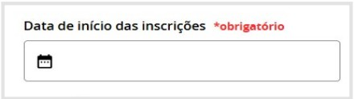

Agora que você já compreende como as **“Oportunidades”** estão organizadas, vamos explorar cada uma das abas, detalhando as seções e os campos disponíveis em cada etapa do processo.

---

## 3.2 Primeira aba: Informações

A Aba **“Informações”** foi estruturada com duas seções principais:

- **1ª Seção: Informações obrigatórias** – Com dois blocos de configuração de campos essenciais que definem o período de inscrições e demais opções de configuração obrigatórias e complementares, permitindo um preenchimento mais detalhado sobre a oportunidade.

- **2ª Seção: Painel lateral** – Contém opções adicionais para o gerenciamento da chamada pública, como configuração de administradores, agentes relacionados, redes sociais e publicação.

A seguir, cada uma dessas seções será apresentada em detalhes.

{/*  */}

---

### 1ª seção: Informações obrigatórias

#### 1° Bloco de configuração - Datas

Este bloco reúne os campos para definir as datas e horários da oportunidade, incluindo: Início e término das inscrições e Publicação do resultado final.  

Essas informações são fundamentais para garantir o correto funcionamento da chamada pública, estabelecendo prazos para os participantes.

Defina o período de inscrição informando as datas de abertura e encerramento da chamada pública.  
Esse prazo determina o período em que os agentes artísticos poderão submeter suas propostas.  

Se a oportunidade não tiver um prazo fixo de encerramento, marque a opção **“Fluxo Contínuo”**, permitindo inscrições abertas de forma permanente.

---

#### 2° Bloco de configuração

Neste bloco, são inseridas as informações principais da oportunidade. A seguir, detalharei cada um desses campos, explicando sua importância e como preenchê-los corretamente.

---

##### A - Nome

Este campo é obrigatório e deve conter o título oficial da oportunidade.  
Escolha um nome claro e objetivo, que represente bem o propósito da chamada pública.  
Evite títulos muito longos ou genéricos, para facilitar a identificação e pesquisa da oportunidade na plataforma.

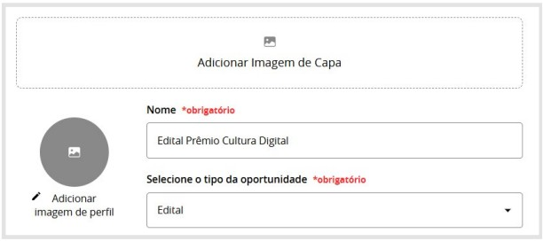

---

##### B - Descrição Curta

Aqui, você deve inserir um resumo da chamada pública em poucas palavras. Esse texto será exibido como um destaque inicial para os usuários, então deve ser direto e informativo, apresentando os principais objetivos e públicos-alvo da oportunidade.

---

##### C - Descrição Longa

Utilize este espaço para fornecer informações detalhadas sobre a oportunidade. A descrição pode incluir:

- ☑ O objetivo da chamada pública e quem pode participar.  
- ☑ Critérios de avaliação e seleção.  
- ☑ Etapas do processo seletivo.  
- ☑ Informações sobre prêmios, bolsas ou incentivos oferecidos.

---

##### D - Adicionar Arquivos

Nesta seção, você pode anexar documentos complementares à chamada pública, como:

- Regulamentos em PDF  
- Modelos de formulários ou anexos obrigatórios  
- Guias e materiais explicativos  

Os arquivos anexados ficarão disponíveis para download pelos interessados.

---

##### E - Adicionar Links

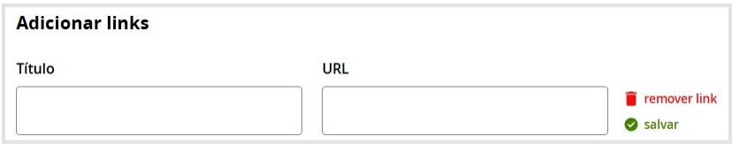

Aqui, você pode incluir links externos relevantes, como:

- ☑ Página oficial da chamada pública.  
- ☑ Formulários de inscrição externos.  
- ☑ Vídeos explicativos ou materiais complementares.  

Certifique-se de que os links estão corretos e direcionam para conteúdos acessíveis ao público.

---

##### F - Galeria de Vídeo

Os vídeos devem estar hospedados em plataformas externas (como YouTube ou Vimeo) e ser incorporados via link.

Se houver vídeos informativos sobre a chamada pública, utilize este espaço para adicioná-los. Os vídeos podem ser:

- ☑ Apresentações sobre a oportunidade.  
- ☑ Depoimentos de participantes anteriores.  
- ☑ Explicações detalhadas sobre o processo de inscrição.

---

##### G - Galeria de Fotos

Nesta seção, é possível adicionar imagens que ilustrem a oportunidade, como:

- ☑ Artes gráficas da chamada pública.  
- ☑ Registros de edições anteriores.  
- ☑ Logos institucionais ou marcas de apoio.

---

## 2ª seção: Lateral de Administração

Na lateral de administração temos um bloco com os seguintes campos:

{/*  */}

### Área de interesse e entidade vinculada

Esses foram os itens cadastrados no início da criação da oportunidade. Neste espaço, você pode atualizar, trocar ou adicionar novas áreas de interesse, além de editar a entidade vinculada à chamada pública.

> Lembre-se de que é essencial definir e manter essas informações sempre atualizadas e corretas, pois elas garantem a classificação adequada da chamada pública e facilitam sua associação aos agentes e instituições responsáveis, aumentando a precisão das buscas e a transparência do processo.

### Adicionar Regulamento

Este campo permite o upload do documento oficial da chamada pública, contendo todas as regras e diretrizes para participação. Certifique-se de que o regulamento está atualizado e acessível, pois será a principal referência para os candidatos.

### Administrado por

Ainda no menu lateral você encontra o item **“administrado por”**.

Indique quem é o responsável pela gestão da chamada pública dentro da plataforma. É possível adicionar um ou mais administradores, que terão permissão para editar as informações da oportunidade e acompanhar as inscrições.

### Agentes Relacionados

Aqui, você pode vincular agentes artísticos ou instituições que estejam diretamente ligados à oportunidade. Os agentes adicionados terão seus perfis conectados à chamada pública dentro da plataforma.

### Redes Sociais

Adicione links para perfis e páginas nas redes sociais relacionadas à chamada pública, como:

- ☑ Facebook, Instagram, Twitter.  
- ☑ Grupos de WhatsApp ou Telegram para tirar dúvidas.  
- ☑ Canais no YouTube para divulgação de vídeos explicativos.  

Isso facilita o engajamento do público e amplia a divulgação da oportunidade.

### Tags

As tags ajudam a categorizar a oportunidade dentro da plataforma, facilitando a busca por palavras-chave. Adicione termos relevantes, como:

- ☑ “Edital de fomento”  
- ☑ “Bolsa de pesquisa”  
- ☑ “Festival de música”  

Quanto mais bem definidas forem as tags, maior será a visibilidade da chamada pública na plataforma.

### Publicado por

Indica quem realizou o cadastro da oportunidade na plataforma. Esse campo é útil para rastrear a origem da chamada pública e manter a transparência na gestão das informações.

### Alterar Propriedade

Caso seja necessário, o administrador pode transferir a propriedade da chamada pública para outro usuário responsável. Essa opção é útil quando há mudanças na equipe de gestão ou redistribuição de funções dentro da organização.

{/*  */}

---

## 3.3 Segunda aba: “Configuração de fases”

A aba **“Configuração de Fases”** é onde o gestor define todas as etapas da chamada pública, estruturando desde a inscrição dos candidatos até a publicação dos resultados finais.  

Nesta seção, é possível configurar cada fase do processo seletivo, como inscrição, avaliação, recursos e coleta de dados, garantindo que o fluxo da chamada pública ocorra de forma organizada e transparente.  

A seguir, detalharemos cada uma das fases disponíveis e suas opções de configuração.

> Abaixo está a imagem ilustrando essa tela. A numeração lateral se ajusta automaticamente de acordo com a quantidade de fases adicionadas ao processo seletivo, garantindo uma organização dinâmica conforme a estrutura da chamada pública.

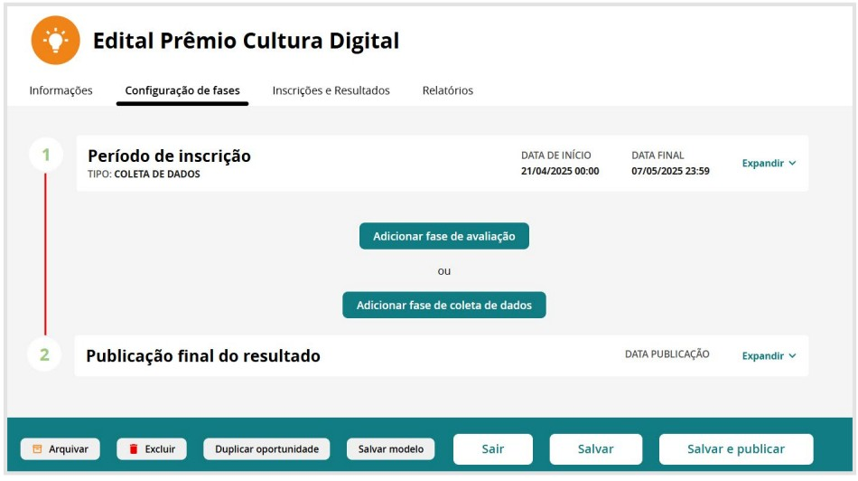

### 2.3.1 Configurar a fase “Período de Inscrição”

A fase de inscrição é um dos momentos centrais do processo seletivo, pois define as regras, formulário e parâmetros para que os agentes artísticos possam se candidatar à oportunidade.

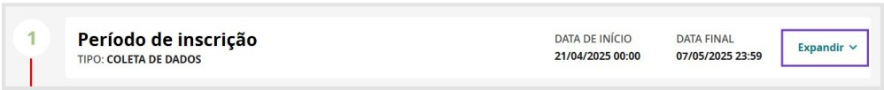

- Ao clicar em **“expandir”** na fase de inscrição, diversas opções estarão disponíveis para personalizar o processo de candidatura à chamada pública.

Essa seção permite definir **datas**, **critérios de participação**, **categorias**, **limites** e outras configurações essenciais para o funcionamento da seleção.

A seguir, apresentamos as principais informações que podem ser configuradas:

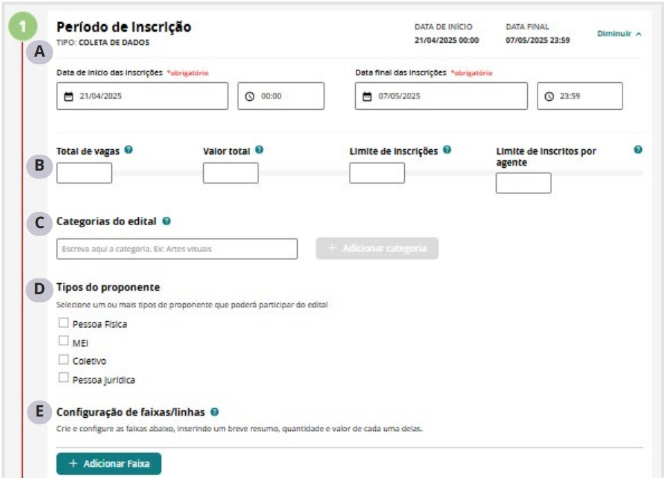

---

### A - Período de Inscrição

As datas que aparecem foram informadas no momento da criação da Oportunidade, mas é possível atualizá-las.  
É importante observar que há o campo **hora** para configurar corretamente **horas e minutos** da sua oportunidade.

- **Data de Início (Obrigatória)**  
  Define a partir de quando as inscrições estarão abertas para os interessados.

- **Data Final (Obrigatória)**  
  Determina o prazo limite para que os agentes realizem suas inscrições.

---

### B - Parâmetros da chamada pública

As seguintes informações **não são obrigatórias**, mas podem ser configuradas para melhor organizar a gestão da seleção e dar mais clareza ao processo seletivo:

- **Total de Vagas**  
  Informe o número total de vagas disponíveis. Útil para chamadas com quantidade limitada de beneficiados.

- **Valor Total**  
  Se aplicável, indique o orçamento total disponível para distribuição. Ajuda a dar transparência ao fomento.

- **Limite de Inscrições**  
  Se esse limite for atingido, as inscrições serão encerradas **antes da data final**.  
  > Se você deseja manter a chamada pública aberta a todos os interessados, **não defina um número máximo**.

- **Limite de Inscrições por Agente**  
  Limita quantas vezes um mesmo agente pode se inscrever.  
  > **Atenção:** Após uma inscrição, o agente **não poderá atualizar ou reenviar** sua proposta.  
  > Se desejar permitir atualizações, **não defina um limite**.  
  > Nesse caso, é fundamental esclarecer no regulamento qual inscrição será considerada válida (por exemplo, a última enviada).

---

### C - Categorias da chamada pública

As **categorias** funcionam como divisões ou áreas de atuação dentro da chamada pública.

Clique em **"Adicionar Categoria"** e escreva as categorias que se aplicam à sua oportunidade.

---

### D - Tipos de Proponente

Selecione os tipos de agentes artísticos elegíveis para participar da chamada pública.  
É possível selecionar uma ou mais opções:

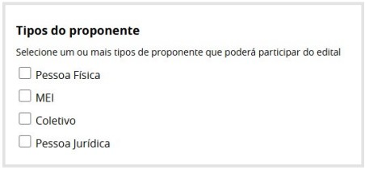

- ☑ **Pessoa Física** – Artistas independentes, produtores, etc.  
- ☑ **MEI (Microempreendedor Individual)** – Profissionais formalizados como MEI.  
- ☑ **Coletivo** – Grupos artísticos sem CNPJ formalizado.  
- ☑ **Pessoa Jurídica** – Empresas, associações e organizações com CNPJ.

---

### E - Configuração de Faixas/Linhas

Se a chamada pública prevê diferentes **faixas de premiação** ou **linhas de apoio**, configure-as nesta seção.

Para cada faixa, informe:

- Nome e descrição da faixa  
- Quantidade de beneficiados  
- Valor destinado para cada faixa

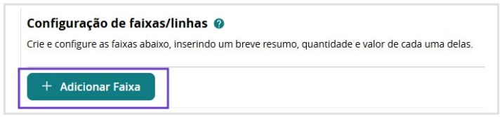

Clique em **"Adicionar Faixa"** e preencha as informações.

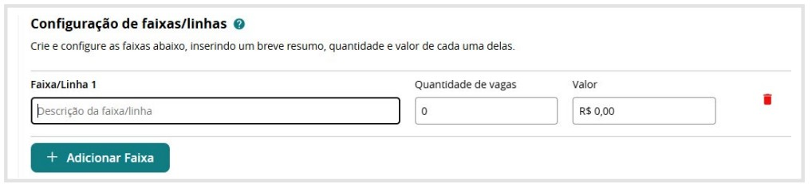

Se houver mais de uma faixa, clique em **“+ Adicionar Faixa”** para criar outras.

---

### F - Recurso

Se a oportunidade permitir **solicitação de recurso**, ative a opção **“Habilitar Recurso”**.

> **Importante:** É necessário definir um **e-mail de destino** para receber os pedidos de recurso.  
> Atualmente, o sistema **não possui uma fase específica** para recursos dentro da própria chamada pública.

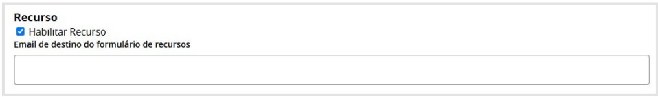

> 💡 **Observação Importante sobre Recursos**

Como a funcionalidade de **recurso ainda não está integrada** como uma etapa formal no processo da seleção, esperamos desenvolvê-la em breve.

Enquanto isso, **alguns gestores têm adotado uma solução alternativa**:  
Criar **uma nova oportunidade exclusiva** para o envio de recursos.

Dessa forma, estruturam um **formulário específico dentro da Plataforma**, garantindo que todo o processo recursal ocorra diretamente por meio do sistema, **sem necessidade de recebimento externo via e-mail**.

---

### G - Configurar Formulário

Na etapa de inscrição, temos o campo **“Configurar Formulário”**, que é essencial para garantir que todas as informações necessárias para a seleção da oportunidade sejam coletadas de maneira clara e organizada.

É por meio dessa configuração que o gestor define **quais dados e documentos serão exigidos dos candidatos**, assegurando um processo seletivo com **transparência e critérios bem estabelecidos**.

#### Nesta seção, é possível:

- Criar campos personalizados para coletar dados como nome, contato, experiência e justificativa do proponente.
- Definir e solicitar documentos obrigatórios (como currículo, portfólio, propostas de projeto, declarações ou anexos).
- Inserir perguntas objetivas ou discursivas.
- Estruturar o formulário de forma intuitiva.

> 💡 **Dica:**  
> Pense em todas as etapas da oportunidade e nos critérios de seleção ao montar o formulário.  
> Uma boa configuração evita retrabalho e garante uma análise eficiente e justa das inscrições.

---

### 1 - Importar Formulário

No topo da página, você verá o período de inscrição e logo abaixo a opção **“Importar Formulário”**.  
Essa funcionalidade permite reaproveitar formulários já utilizados em outras oportunidades.
Após a importação, os campos podem ser ajustados conforme necessário. Conforme abaixo:

---

### 2 - Como Exportar e Importar um Formulário de Outra Oportunidade

**Passo a passo:**

1. Localize a oportunidade com o formulário desejado:
   - `Minha Conta > Minhas Oportunidades > Edição da Oportunidade > Configuração de Fases > Expandir em “Período de Inscrição” > Configurar Formulário > Exportar`

2. O sistema fará o download de um arquivo no formato:
   - `opportunity-XXXX-fields.txt`  
   (onde `XXXX` é o número da oportunidade).

3. Volte à nova oportunidade e clique em **“Importar”**, enviando o arquivo baixado.

---

Agora que você já compreende como importar e exportar formulários, vamos explorar os demais itens disponíveis nesta tela.

---

### 3 - Habilitar Campo para Vínculo de Espaço

Permite que o proponente associe sua inscrição a um **espaço artístico cadastrado** na plataforma.

Opções:

- ☑ **Desabilitado** – O campo não aparece.
- ☑ **Obrigatório** – O candidato deve selecionar um espaço.
- ☑ **Opcional** – O campo é exibido, mas não obrigatório.

---

### 4 - Habilitar Campo de Nome do Projeto

Permite que o candidato dê um **nome ao projeto** no momento da inscrição.

Opções:

- ☑ **Desabilitado** – O campo não será exibido.
- ☑ **Obrigatório** – O campo deve ser preenchido.
- ☑ **Opcional** – Preenchimento não é obrigatório.

---

### 5 - Habilitar Solicitação de Imagem de Perfil

Permite o upload de uma **imagem de perfil** durante a inscrição.

Opções:

- ☑ **Desabilitado** – Nenhuma imagem será solicitada.
- ☑ **Habilitado** – O campo será exibido.

> Pode ser útil para editais com apresentações públicas, seleção por portfólio visual ou identificação artística.

---

### 6 - Habilitar Pergunta “Vai concorrer às cotas?”

Adiciona ao formulário a pergunta sobre **concorrer às cotas afirmativas**, se previstas na chamada pública.

Opções:

- ☑ **Desabilitado** – A pergunta não aparecerá.
- ☑ **Habilitado** – O candidato poderá indicar se deseja concorrer às cotas.

> Essencial para processos seletivos com políticas de diversidade e inclusão.

---

### 7 - Configuração do Formulário: Entendendo Etapas e Campos

A configuração do formulário é **estruturada em etapas**, permitindo uma organização mais clara e eficiente das informações solicitadas aos proponentes ao longo do processo de inscrição.

---

### 8 - O que são Etapas?

As **etapas** funcionam como seções dentro do formulário de inscrição, agrupando perguntas e informações de acordo com a necessidade da seleção.

Elas permitem **segmentar o processo de inscrição**, facilitando a navegação do candidato e a análise das respostas pelos gestores.

> ✅ As etapas são **personalizáveis**, e você pode criar quantas forem necessárias para sua chamada pública.

---

#### Exemplo de Estrutura de Etapas:

- **Etapa 1: Dados Pessoais**  
  Coleta de informações básicas do proponente:
  - Nome completo
  - CPF
  - Contatos
  - Dados bancários (se aplicável)

- **Etapa 2: Descrição do Projeto**  
  Espaço para detalhamento da proposta inscrita:
  - Nome do projeto
  - Objetivos
  - Justificativa
  - Público-alvo
  - Metodologia

- **Etapa 3: Documentação**  
  Área destinada ao envio de documentos obrigatórios:
  - Currículo
  - Portfólio
  - Declarações
  - Certidões
  - Outros anexos exigidos

- **Etapa 4: Informações Complementares**  
  Campos adicionais:
  - Autodeclaração para cotas
  - Comprovação de experiência
  - Anexos opcionais
  - Perguntas específicas

---

### 💡 Importante

As etapas podem ser **editadas**, **reordenadas** ou **removidas** a qualquer momento durante a configuração do formulário.

No exemplo abaixo, já foram criadas:

- Etapa 1 – Dados Pessoais  
- Etapa 2 – Descrição do Projeto

Agora, estamos na configuração da:

- **Etapa 3 – Documentação**

Nela, é possível personalizar os campos conforme a necessidade da oportunidade.

Essa estrutura **modular** torna o formulário:

- Mais **organizado** para os candidatos.
- Mais **intuitivo** para os avaliadores.
- Mais **eficiente** para o processo seletivo como um todo.

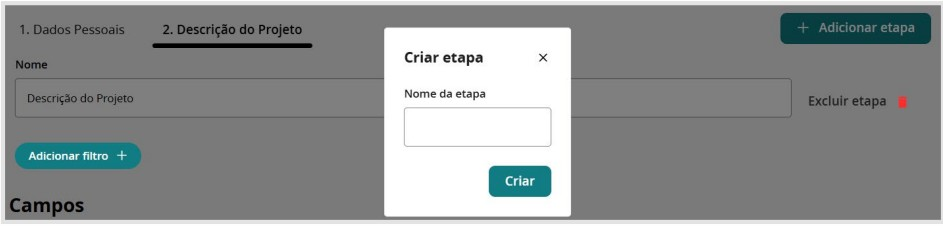

---

### 9 - O que são Campos?

Os **campos** são os elementos dentro de cada etapa do formulário, onde o candidato insere as informações solicitadas.

Eles podem assumir **diferentes formatos**, dependendo do tipo de dado que será coletado — como textos, datas, números, arquivos, seleções, entre outros.

Esses campos são essenciais para garantir que todas as **informações necessárias** ao processo seletivo sejam registradas de forma clara e organizada.

---

### 10 - Síntese dos Campos Disponíveis na Configuração do Formulário

Na configuração do formulário, há diversos tipos de campos disponíveis para **personalizar a inscrição** e **coletar as informações necessárias** dos proponentes.

A seguir, apresentamos uma síntese dos **principais campos** que podem ser utilizados:

---

#### 📂 Organização e Identificação

- `#` **Título de Seção**  
  Organiza o formulário em blocos visuais, separando as informações por temas ou etapas.

- `@` **Campo do Agente Coletivo**  
  Permite vincular um coletivo artístico à inscrição.

- `@` **Campo do Agente Responsável**  
  Identifica o responsável legal pela inscrição, especialmente útil para coletivos ou organizações.

- `@` **Campo do Espaço**  
  Associa a inscrição a um espaço cultural previamente cadastrado na plataforma.

---

#### ✅ Campos de Seleção

- **Caixa de Verificação (Checkbox)**  
  Para opções como: "Sim/Não", "Aceito os termos", "Desejo concorrer às cotas", etc.

- **Seleção Única**  
  Campo do tipo *radio button* para escolher **apenas uma opção**.

- **Seleção Múltipla**  
  Permite marcar **mais de uma alternativa** entre as opções disponíveis.

---

#### 🧾 Dados Pessoais e Jurídicos

- **Campo de CPF**  
  Para inserção do número de Cadastro de Pessoa Física.

- **Campo de CNPJ**  
  Para preenchimento do Cadastro Nacional de Pessoa Jurídica.

- **Campo de E-mail**  
  Coleta o endereço de e-mail do candidato.

- **Campo de Telefone do Brasil**  
  Para números com DDD (ex: (11) 91234-5678).

- **Campo de Data**  
  Ideal para datas de nascimento, prazos de execução, entre outros.

- **Seleção de Município**  
  Lista para escolher a cidade de residência ou atuação do proponente.

---

#### 🌐 Campos Digitais e de Conteúdo

- **Campo de URL (Link)**  
  Inserção de links externos como sites, redes sociais ou páginas de projetos.

- **Campo de Listagem de Links**  
  Permite incluir **vários links**, como vídeos, portfólios ou matérias de divulgação.

- **Campo de Listagem de Endereços**  
  Adiciona múltiplos endereços físicos, útil para projetos com atuação em várias localidades.

- **Campo de Listagem de Pessoas**  
  Para inserir membros da equipe, colaboradores ou responsáveis técnicos.

---

#### 💰 Financeiro e Logístico

- **Campo de Moeda (R$)**  
  Utilizado para inserir valores financeiros (orçamento, premiação, custos).

- **Campo Numérico**  
  Para números inteiros como idade, número de participantes ou duração do projeto.

- **Campo de Dados Bancários**  
  Solicita informações como banco, agência e número da conta.

---

#### ✍️ Descrição e Texto

- **Campo de Texto Simples**  
  Para respostas curtas como nome, cargo, função ou título do projeto.

- **Campo de Texto (Textarea)**  
  Para textos longos como justificativas, descrição da proposta, cronograma etc.

---

> Esses campos garantem **flexibilidade** na construção do formulário, permitindo que cada chamada pública seja estruturada de forma **eficiente, clara e alinhada** às exigências do processo seletivo.

---

### 11 - Adicionando campo

Para adicionar um campo basta clicar em **adicionar campo**, conforme imagem abaixo:

Ao adicionar um novo campo, uma caixa de configuração será exibida. No item “Tipo de Campo”,
você poderá selecionar o formato do campo desejado, e, logo abaixo, serão apresentadas opções
específicas de configuração, que variam de acordo com o tipo selecionado.

Alguns itens são comuns a todos os campos e devem ser preenchidos para garantir clareza na
inscrição:

- **Nome do Campo**  
  Identificação do campo no formulário.

- **Descrição do Campo**  
  Explicação ou instruções para o preenchimento.

- **Tipo de Campo**  
  Definição do formato do dado a ser coletado (texto, numérico, seleção, etc.).

- **Obrigatoriedade**  
  Checkbox para marcar o campo como obrigatório ou opcional.

- **Definição por Tipo de Proponente**  
  Checkbox que permite selecionar para quais tipos de candidaturas o campo será aplicado,  
  útil em editais que possuem múltiplas categorias.

Abaixo, segue um exemplo de como essa configuração será exibida na tela:

Segue um exemplo da Etapa de identificação do Projeto com alguns campos como exemplo:

---

### H - Plano de Metas – Configuração na Fase de Inscrição

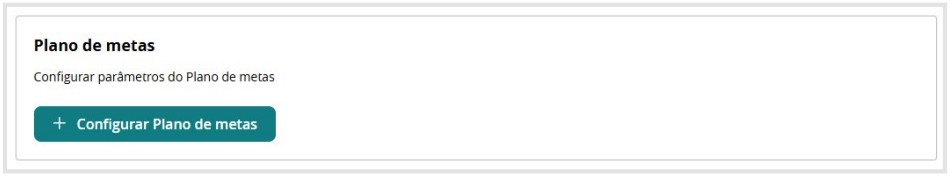

A configuração do **Plano de Metas** permite definir os **objetivos e entregas esperadas** dos projetos inscritos na chamada pública. Essa estrutura possibilita o acompanhamento mais detalhado da execução dos projetos fomentados, garantindo **maior transparência** e controle dos resultados.

#### ➕ Configurar Plano de Metas

Ao clicar em **+ Configurar Plano de Metas**, a plataforma exibe a seguinte tela:

---

#### 📆 Duração do Projeto

- **Campo:** Duração máxima (em meses)
- **Descrição:** Define o tempo limite para execução do projeto.
- **Valor 0:** Indica que não há limite de duração.

---

#### 🎯 Metas

- **Definição:** Representam os **principais objetivos** do projeto.
- **Composição:** Cada meta pode conter uma ou mais entregas.
- **Limite de metas:** Pode ser definido pelo gestor ou deixado livre (valor 0).

---

#### 📦 Entregas

- **Descrição:** São os **produtos, serviços ou atividades** resultantes do projeto.
- **Relação com metas:** Cada meta deve conter pelo menos uma entrega.
- **Finalidade:** Mensurar o impacto e os resultados concretos esperados.

---

### I - Publicação de Resultados (Opcional)

A publicação dos resultados pode ser automatizada ou feita manualmente.

#### ⚙️ Configurações disponíveis:

- **Data e Hora de Publicação dos Resultados**
  - Permite programar a divulgação com antecedência.

- **Publicar Resultado Automaticamente**
  - Se habilitado, o sistema publicará os resultados na data/hora programadas.

---

### 2.3.2 Adicionar Fase de Avaliação

A fase de **Avaliação** permite criar e personalizar o processo de análise das inscrições, assegurando uma **seleção transparente e estruturada**.

#### ➕ Adicionar Fase de Avaliação

Clique em **“Adicionar fase de avaliação”** para iniciar a configuração dessa etapa.

- Pode conter uma ou mais fases, conforme previsto no regulamento.
- Cada fase pode ter seus próprios critérios e avaliadores.

Ao clicar em **“Adicionar fase de avaliação”**, surge a seguinte tela:

Neste momento, o responsável pela configuração da oportunidade deverá definir o tipo de
avaliação, nomear essa fase e estabelecer o período de execução, especificando a data e
horário de início e a data e horário de término.

No exemplo criado para mostrar as funcionalidades da Rede das Artes, temos a seguinte
proposta de configuração:

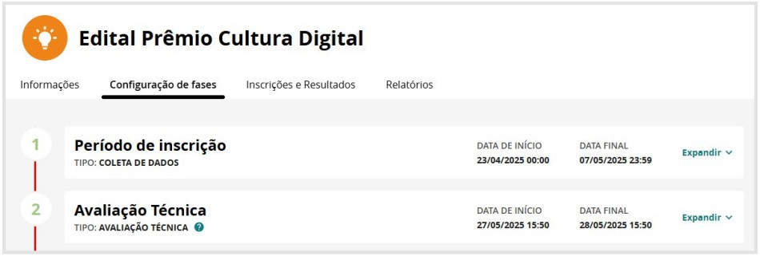

Você pode criar quantas fases de avaliação necessitar, com o tipo de avaliação que julgar
necessário, inclusive, com avaliação documental e depois de mérito.

Para configurar cada uma dessas fases, basta clicar em **“expandir”**:

> Ao expandir a fase o gestor tem acesso a um conjunto de configurações que permitem personalizar os critérios e parâmetros dessa etapa, garantindo que a análise dos documentos enviados pelos candidatos seja realizada de forma estruturada, transparente e eficiente.

---

### Tipos de Fase de Avaliação

Na configuração da seleção, o gestor pode definir diferentes **tipos de fase de avaliação**, adequando o processo seletivo às necessidades da oportunidade. 

Cada tipo de avaliação possui critérios específicos para análise das inscrições, podendo incluir:

- ✅ Verificação documental  
- ✅ Habilitação documental  
- ✅ Avaliação técnica  
- ✅ Análise simplificada

> **A escolha do tipo de avaliação influencia diretamente a forma como as inscrições serão analisadas e os critérios utilizados para a seleção dos candidatos.**

Dessa forma, como é possível visualizar na tela abaixo, ao clicar em **“tipo”**, a plataforma disponibiliza **quatro tipos de avaliação**, cada uma adequada a diferentes critérios de análise.  
A seguir, explicamos as diferenças entre elas:

---

### Tipos de Avaliação na Plataforma

Ao configurar a fase de avaliação, a plataforma disponibiliza **quatro tipos de avaliação**, cada uma adequada a diferentes critérios de análise. Abaixo, detalhamos cada uma:

---

#### 1. Avaliação de Documentação
Esse tipo de avaliação é voltado para a **checagem de documentos obrigatórios** enviados pelos inscritos.  
O avaliador verifica se os arquivos anexados estão corretos e se atendem aos requisitos do regulamento.  
> 🔍 Essa etapa pode ser usada como um **primeiro filtro** antes da análise de mérito.

---

#### 2. Avaliação de Habilitação Documental
Diferente da anterior, que apenas verifica a **presença dos arquivos**, essa modalidade tem um caráter **mais criterioso**.  
O avaliador analisa se os documentos realmente atendem às exigências da chamada pública, considerando:
- Validade
- Autenticidade
- Conformidade com os critérios estabelecidos

---

#### 3. Avaliação Simplificada
Permite uma avaliação **direta e objetiva** das inscrições, **sem necessidade de notas detalhadas** ou critérios técnicos complexos.  
> ⚡ Usada em processos seletivos mais rápidos ou editais com triagem básica.

---

#### 4. Avaliação Técnica
Essa é a **avaliação mais detalhada**, voltada para projetos que exigem análise aprofundada.  
O avaliador atribui **notas com base em critérios técnicos**, como:
- Impacto cultural
- Viabilidade do projeto
- Relevância artística

Ideal para editais de **seleção de projetos artísticos ou premiações** com critérios específicos.

---

### Quadro Comparativo
Abaixo, apresenta-se um quadro comparativo com os itens de configuração de cada tipo de avaliação.  
Alguns desses itens são **comuns aos quatro tipos**, assegurando um padrão estrutural no processo seletivo.

> A planilha a seguir destaca claramente as semelhanças e diferenças entre os tipos de avaliação.

> Dessa forma, iniciaremos a apresentação detalhando primeiro os **campos comuns a todas as modalidades de avaliação**.

Em seguida, abordaremos os **campos adicionais específicos da Avaliação de Habilitação Documental e Técnica** e, por fim, os **itens exclusivos da Avaliação Técnica**.

---

## Detalhamento dos Campos Comuns dos 4 Tipos de Avaliação

A seguir, detalhamos as configurações comuns aos quatro tipos de avaliação, utilizando a **Avaliação Documental** como referência para exemplificar cada item de forma clara e objetiva.

Observe a imagem da tela com todos os itens de configuração disponíveis nessa fase:

- Agora vamos explicar cada um destes itens. Essa configuração possibilita um processo seletivo mais organizado, permitindo que os gestores definam critérios de análise, composição das comissões avaliadoras, visibilidade de informações e regras para publicação de resultados.

Abaixo segue o detalhamento de todas as opções de configuração:

### Título e Período da Avaliação Documental

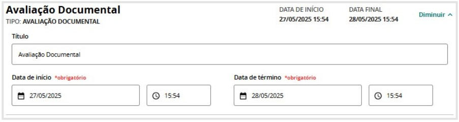

Aqui, o gestor deve definir o nome da avaliação e o período da avaliação documental:

- **Data de Início (Obrigatório)**  
  Define o momento exato em que a análise dos documentos poderá ser iniciada pelos avaliadores.

- **Data de Término (Obrigatório)**  
  Determina até quando os documentos podem ser avaliados dentro do sistema.

Essa configuração é fundamental para garantir que os avaliadores tenham um prazo claro para concluir a análise da documentação submetida pelos candidatos.

---

### Configurando a/as Comissão/ões de Avaliação

Nesta seção, é possível definir os avaliadores responsáveis pela análise da documentação.

- **Título da Comissão**  
  Permite criar uma comissão com um nome específico para organização do processo seletivo.

- **Adicionar Comissão**  
  A opção “Adicionar Comissão” permite a criação de novos grupos de avaliadores para diferentes etapas ou critérios de avaliação. Cada comissão pode receber um nome específico, facilitando a organização do processo seletivo.

No exemplo abaixo, foram criadas três comissões. Se a chamada pública possuir quatro categorias, será possível adicionar mais uma comissão clicando em **“Adicionar Comissão”**, garantindo que cada grupo de avaliadores esteja devidamente configurado conforme a necessidade da oportunidade.

**Excluir Comissão** – Ao clicar em “excluir comissão” você remove a comissão criada. Observe que no exemplo abaixo estou dentro da comissão criada com nome **“Categoria Produção Multimídia”**:

**Limitar número de avaliadores por inscrição** – Define quantos avaliadores poderão analisar cada inscrição.

**Configuração de Filtro de Inscrição para Avaliadores/Comissão** – Permite selecionar um filtro com base nos campos configurados no formulário de inscrição.  
Por exemplo, se as comissões forem organizadas por categoria, é possível atribuir a comissão específica à categoria correspondente.

**Adicionar Pessoa Avaliadora** – Opção para incluir avaliadores só está disponível dentro da aba habilitados na comissão responsável pela avaliação. O avaliador precisa ter realizado o cadastro na plataforma. Se nenhum avaliador for adicionado, a lista permanecerá vazia, sendo necessário configurar essa etapa antes do início da avaliação.

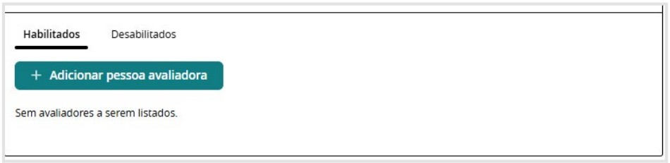

---

### **Configuração de Campos Visíveis para os Avaliadores**

**Abrir Lista de Campos**  
Define quais campos do formulário de inscrição serão visíveis para os avaliadores durante a análise. Isso permite que apenas informações relevantes para a fase sejam acessadas pelos avaliadores, evitando dados desnecessários.  

Ao clicar em “abrir lista de campos” aparecem todos os campos disponíveis no formulário de inscrição para a seleção:

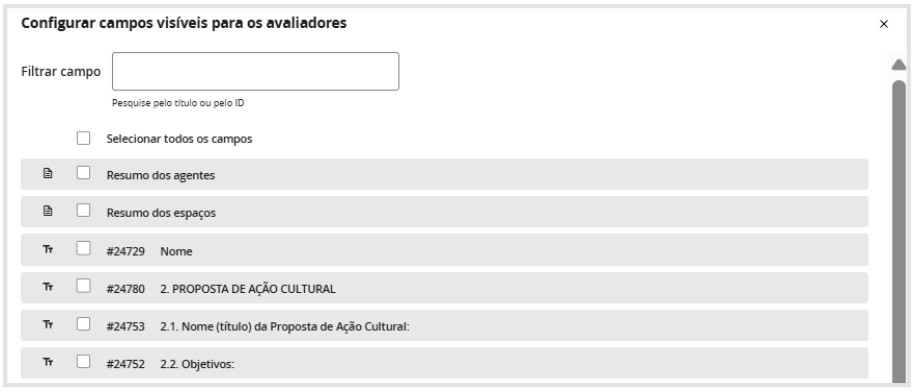

---

### **Adicionar Textos Explicativos das Avaliações**  

## **Texto Configuração Geral**  
Permite inserir instruções ou orientações para os avaliadores, explicando critérios, normas e regras da avaliação documental.  
Essa funcionalidade pode ser usada para esclarecer o que deve ser verificado nos documentos, garantindo mais padronização na análise.

---

## **Publicação de Resultados**  
A publicação de resultados é opcional, assim como na fase da inscrição. 
Entretanto, nesta fase aparecem mais 3 opções abaixo da configuração da data. Segue a explicação dos campos:

- **Data e Hora de Publicação dos Resultados**  
  Permite programar a divulgação dos resultados da avaliação documental.  
  > **Observação:** A publicação do resultado é opcional – caso não seja configurada uma data automática, o resultado poderá ser publicado manualmente.

- **Publicar Resultado Automaticamente**  
  Se ativada, essa opção tornará os resultados públicos assim que a data configurada for atingida.

- **Publicar os Pareceres para o Proponente**  
  Permite que os inscritos tenham acesso ao parecer da sua avaliação documental.

- **Publicar o Nome dos Avaliadores nos Pareceres**  
  Se ativado, os pareceres exibirão o nome dos avaliadores responsáveis pela análise.

- **Autoaplicação de Resultados**  
  Se ativada, essa opção faz com que o sistema aplique automaticamente os resultados da avaliação, classificando os candidatos conforme as regras definidas.

---

## Recurso

Em síntese, ao habilitar o recurso é necessário definir para qual e-mail os pedidos de recurso serão enviados.

> Por fim, há a opção excluir fase de avaliação, que está destacada na imagem acima.

---

## Configurações específicas em Avaliação de Habilitação Documental e Avaliação Técnica

### Adicionar Seção de critérios de avaliação

Nesta parte, é possível personalizar os critérios que serão utilizados na avaliação das inscrições.

Abaixo, explicamos cada uma das opções disponíveis:

## Configurações específicas em Avaliação de Habilitação Documental e Avaliação Técnica

### Adicionar Seção de critérios de avaliação

Nesta parte, é possível personalizar os critérios que serão utilizados na avaliação das inscrições.

Abaixo, explicamos cada uma das opções disponíveis:

### 🔹 Nome da Seção

Permite definir um título para a seção, organizando os critérios dentro da avaliação.  
Isso facilita a categorização dos aspectos analisados, como:

- “Critérios Técnicos”
- “Relevância do Projeto”
- Entre outros

### 🔹 Excluir

Opção para remover a seção criada, caso não seja mais necessária.

### 🔹 Limitar Número Máximo de Critérios Não Eliminatórios por Seção

Essa configuração permite estabelecer um limite para o número de critérios avaliativos que **não desclassificam automaticamente** uma inscrição.  
Isso pode ser útil para manter a avaliação mais objetiva e evitar sobrecarga de informações.

### 🔹 Configurar Filtro

Ajuste que possibilita a definição de parâmetros específicos para a **exibição ou aplicação de critérios**, garantindo que apenas determinadas inscrições passem por avaliações específicas.

### 🔹 Parecer da Seção Obrigatório

Se ativado, obriga os avaliadores a emitirem um **parecer justificativo** sobre as notas ou decisões tomadas dentro daquela seção, garantindo **maior transparência e fundamentação** nas avaliações.

>Essas opções ajudam a estruturar a avaliação de forma mais organizada, garantindo que os critérios sejam aplicados de maneira **clara e eficiente** dentro do processo seletivo.

---

## Configurações específicas em Avaliação Técnica

Os campos listados a seguir se aplicam somente ao **Tipo de Avaliação Técnica**.

### 🔹 Exequibilidade da inscrição

**Exequibilidade** refere-se à capacidade de uma inscrição ser efetivamente realizada conforme os requisitos estabelecidos no regulamento da seleção.

Isso envolve avaliar se o proponente possui as condições necessárias, como:

- Recursos
- Habilidades
- Experiência

Esses fatores são essenciais para executar o que foi prometido.

A análise da exequibilidade é crucial para garantir que as propostas aceitas possam ser efetivamente implementadas, **evitando compromissos inviáveis**.

### 🔹 Configurar critérios de desempate

A **Configuração de Critérios de Desempate** permite definir quais parâmetros serão utilizados para classificar candidatos com **pontuação igual** na avaliação.

Essa opção aparece logo abaixo da seção de **Exequibilidade** e, ao ser selecionada, abrirá uma interface para configuração dos critérios de desempate.

### Na caixa escrita “critério 1”

Representa o **primeiro critério** que será considerado caso dois ou mais candidatos obtenham a **mesma pontuação final**.

No item **“Selecione um Critério”**, o gestor deve escolher qual será o critério de desempate, podendo ser baseado em itens como:

- ☑ **Maior pontuação em um critério específico**  
  (ex.: impacto cultural, viabilidade do projeto, currículo do proponente)

- ☑ **Ordem de inscrição**  
  (priorizando quem se inscreveu primeiro)

- ☑ **Critérios de políticas afirmativas**  
  (caso aplicável)

Caso necessário, podem ser adicionados **critérios de desempate adicionais** para garantir que a classificação final seja bem definida e sem margem para dúvidas.

---

### 🔹 Configuração das Políticas Afirmativas

A funcionalidade de **Políticas Afirmativas** permite que a seleção:

- Reserve **vagas para grupos específicos**
- Conceda **bônus de pontuação** a determinados perfis de candidatos

O objetivo é **promover maior equidade** no processo seletivo.

> Antes de configurar essas opções, é necessário **definir o número total de vagas disponíveis** na seleção.

> ⚠️ **Importante:** Nas configurações de **cota** ou de **distribuição de vagas por territórios**, se o **número total de vagas** não estiver configurado na etapa da inscrição, essas opções **não poderão ser ativadas**.

O **primeiro passo** para utilizar as políticas afirmativas é **estabelecer a quantidade de vagas disponíveis** na chamada pública.

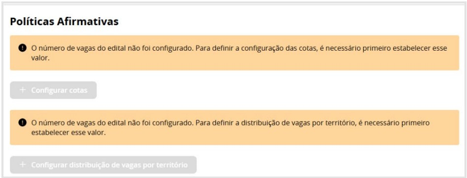

---

## Como configurar as opções dentro das Políticas Afirmativas

Vamos agora explicar como configurar as **3 opções** disponíveis dentro da configuração das Políticas Afirmativas:

### 1. ✅ Configurar Cotas

Essa opção permite estabelecer **percentuais** ou **números fixos** de vagas destinadas a **grupos sociais específicos**, como:

- Pessoas Negras
- Indígenas
- Quilombolas
- Pessoas com Deficiência (PcD)
- Mulheres
- Outros grupos, conforme critérios definidos na seleção

---

### 2. ✅ Configurar Distribuição de Vagas por Território

Caso a chamada pública tenha um recorte territorial, é possível distribuir as vagas por região, estado ou município. Essa configuração é essencial para editais que visam contemplar múltiplos territórios de forma equilibrada.

Ao clicar em “+ configurar distribuição de vagas por território” aparecerá a seguinte opção:

Dentro da opção de divisão territorial surgem as seguintes opções:

---

### 3. Configurar Bônus de Pontuação

Em vez de reservar vagas específicas, essa opção permite conceder pontuação adicional a determinados grupos, garantindo que políticas afirmativas sejam aplicadas sem necessariamente limitar o número de vagas disponíveis para cada perfil.

---

## 2.3.3 Adicionar “Fase de Coleta de Dados”

A **Fase de Coleta de Dados** é uma etapa que permite a obtenção de informações adicionais dos candidatos inscritos, seja para:

- Complementação de dados
- Envio de documentos extras
- Realização de ajustes no processo de seleção

Diferente da fase de inscrição, essa etapa pode ser utilizada para solicitar informações específicas antes da avaliação final ou para confirmar dados fornecidos anteriormente.

Nesta fase, o gestor pode configurar os seguintes itens:

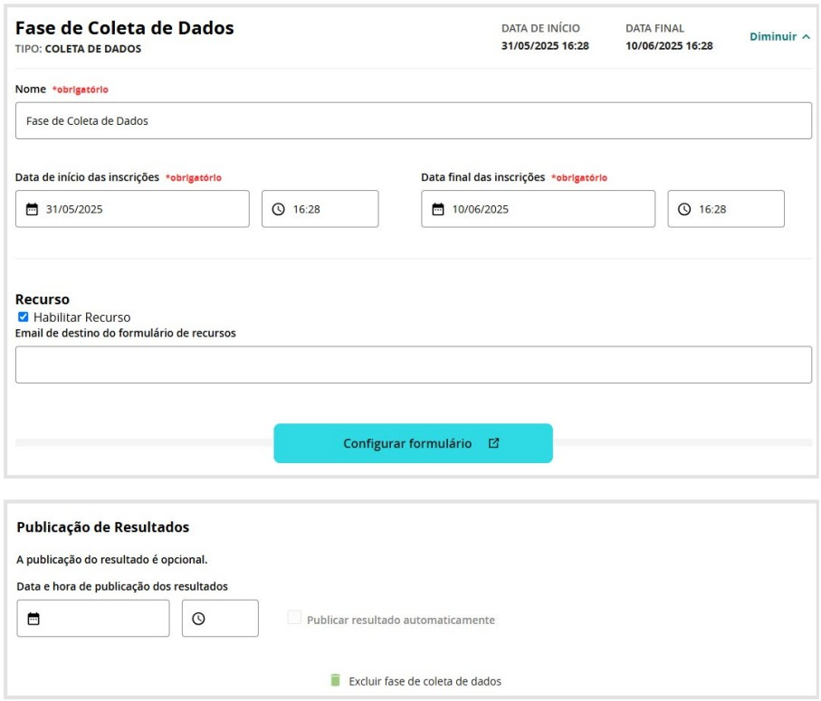

### 🔹 Nome da Fase (Obrigatório)

Define um título para essa etapa, facilitando a organização da chamada pública.

### 🔹 Período da Coleta de Dados (Obrigatório)

Especificação da **data e horário de início e término** da fase, determinando o prazo no qual os candidatos poderão fornecer as informações solicitadas.

### 🔹 Configuração de Formulário

Assim como na fase de inscrição, é possível **criar e personalizar um formulário** para a coleta de dados.  
Para configurar essa etapa corretamente, consulte as instruções detalhadas na seção de **Inscrição** (ver páginas anteriores).

### 🔹 Recurso

Se necessário, pode-se **habilitar um canal de recurso**, definindo um e-mail para o qual os candidatos poderão enviar contestações relacionadas a essa fase.

### 🔹 Publicação de Resultados

Caso seja relevante, é possível programar a **divulgação automática** dos resultados dessa fase, estabelecendo **data e horário para publicação**.  
Essa opção também permite realizar a **publicação manualmente**.

Essa fase é **opcional**, mas pode ser extremamente útil para editais que necessitam de etapas adicionais de **confirmação de informações**, garantindo maior **precisão** no processo seletivo.

---

## 2.3.4 Fase “Publicação do Resultado Final”

A **Fase de Publicação Final do Resultado** marca a **conclusão do processo seletivo**, tornando público o resultado definitivo dos candidatos aprovados.

Essa etapa garante **transparência** à seleção, permitindo que todos os participantes tenham acesso às informações sobre a seleção.

Nesta fase, o gestor terá acesso aos **mesmos itens de configuração de publicação de resultados** das fases anteriores:

### 🔹 Data de Publicação

Define o **momento exato** em que os resultados finais serão divulgados, garantindo **previsibilidade para os candidatos**.

### 🔹 Publicação de Resultados

Permite determinar **como e quando** o resultado será disponibilizado, com as seguintes opções:

#### ▷ Publicar Resultado Automaticamente

O gestor pode decidir se o resultado será divulgado **automaticamente** ou **manualmente**.

Se ativada, essa opção permite que o sistema **publique o resultado final no horário previamente definido**.

### 🔹 Recurso

Caso a chamada pública permita a **contestação do resultado final**, o gestor pode:

#### ▷ Habilitar Recurso

Ativa a possibilidade de **contestação** para o candidato.  
Entretanto, será preciso informar o **e-mail de destino dos recursos**.

#### ▷ E-mail de Destino do Formulário de Recursos

Define o **contato** para onde as solicitações de recurso serão enviadas.

---

## 2.4. Aba Inscrições e Resultados

A aba **Inscrição e Resultados** serve para o **acompanhamento das fases**.  
Clicando em **expandir**, você acessa as informações da fase configurada.

Abaixo apresento o **acompanhamento de fase** de uma seleção recém configurada e ainda **sem inscrição**. Observe que **não há inscrições para acompanhamento**:

Agora observe um exemplo de um **Edital totalmente construído pela plataforma**, que foi o **Edital de Agentes Territoriais de Cultura do Nordeste**:

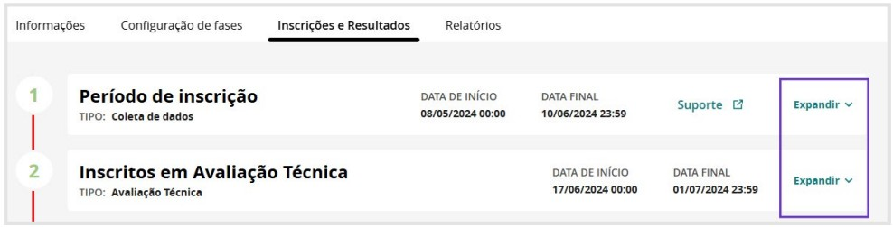

---

### 2.4.1. Acompanhar a Fase de Inscrição

Ao clicar em **Lista de Inscrições**, sou redirecionada a uma página em que é possível acessar **todas as inscrições**, com **opções de filtros para pesquisa**:

Ao clicar em **“Exportar planilha”**, tenho acesso a **todos os dados dos inscritos** nos seguintes formatos:

---

### 2.4.2. Acompanhar a Fase de Avaliação

Ao clicar em **Lista de Avaliações**, é possível acompanhar o **processo de avaliação da Comissão de Seleção**.

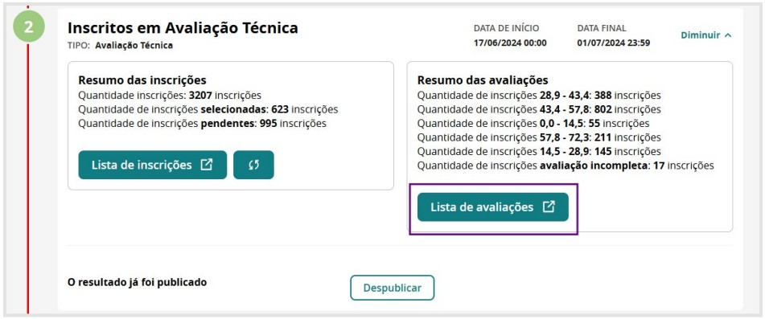

> **Observação:**  
> A informação sobre **inscrições pendentes e incompletas** refere-se aos candidatos que realizaram **mais de uma inscrição** no certame.  
> 
> Nesses casos, a comissão de avaliação **considerou apenas a última inscrição enviada pelo candidato**, desconsiderando as anteriores.  
> 
> Esse procedimento garante que **cada participante tenha apenas uma candidatura válida** dentro do processo seletivo.

> **Observação:** Os nomes dos avaliadores, agentes e parte da inscrição estão ocultados no tutorial.

Da mesma maneira que na inscrição, é possível exportar planilha com os dados nos seguintes formatos: 

---

## 2.5 Aba Relatórios

Nessa fase, a própria plataforma constrói relatórios sobre o processo de seleção. Basta, novamente, clicar em “expandir” para ter acesso:

- Relatórios de Inscrições:

- Relatórios de Resultado de Avaliação:

- Relatórios de Categorias da Oportunidade:
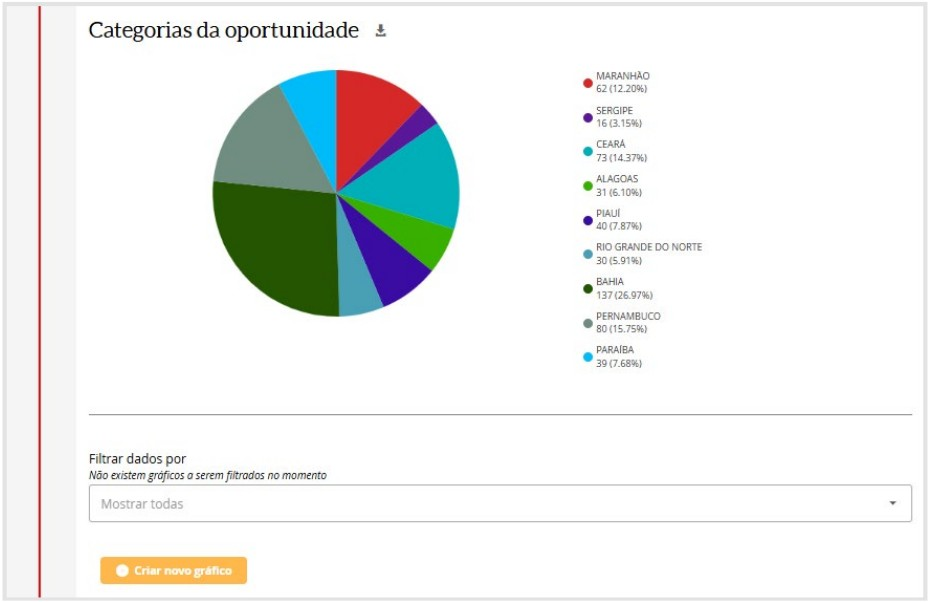

