## Gerenciando uma oportunidade criada

Depois de criar uma oportunidade, o próximo passo é revisar, complementar e organizar todas as informações antes da publicação.

Se você ainda não criou a oportunidade, consulte a página [Criar Oportunidade](./criar-oportunidade).

Você pode chegar à tela de gerenciamento de duas formas:

1. Logo após a criação, clicando em **Completar informações**.
2. Pelo **Painel de Controle**, na seção **Ente Federado** > **Oportunidades**, acessando a aba em que a oportunidade está salva.

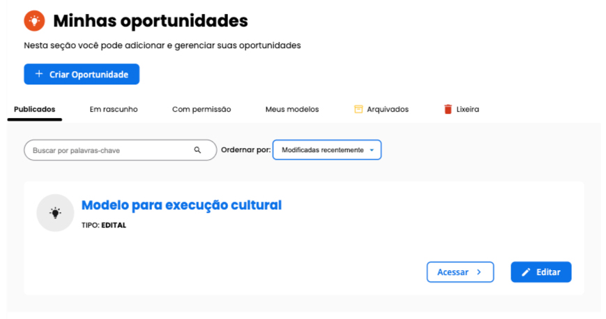

> Quando a oportunidade aparece na aba **Em rascunho**, isso significa que ela já foi criada, mas ainda não foi publicada para o público.

---

## Acessar ou editar a oportunidade

Na listagem de oportunidades, cada item costuma oferecer pelo menos duas ações principais:

- **Acessar**: abre a visualização pública da oportunidade, mostrando como ela será apresentada aos proponentes.
- **Editar**: abre a tela de gerenciamento para configurar os dados da chamada pública.

Ao clicar em **Acessar**, você verá a página pública da oportunidade:

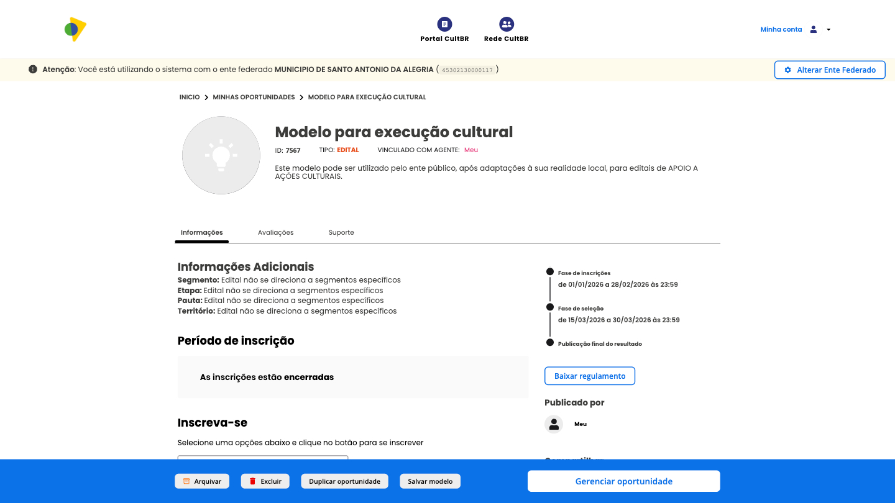

Se quiser voltar para a edição a partir dessa visualização, clique em **Gerenciar oportunidade**.

---

## Como a tela de gerenciamento está organizada

Antes de preencher os campos, vale entender como a plataforma organiza a edição da oportunidade.

O gerenciamento é estruturado em níveis que ajudam a localizar cada informação com mais facilidade:

- **Abas**: dividem a tela em grandes áreas de trabalho.
- **Seções e blocos**: agrupam informações relacionadas dentro de cada aba.
- **Campos e itens de configuração**: são os espaços em que você preenche, seleciona ou envia informações.

### Abas principais

O Cult Editais organiza o gerenciamento das oportunidades em quatro abas:

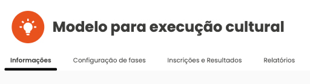

1. **Informações**
2. **Configuração de Fases**
3. **Inscrições e Resultados**
4. **Relatórios**

Nesta página, vamos tratar da aba **Informações** e da estrutura geral da tela.

As demais abas têm páginas próprias no manual:

- [Configuração de Fases](./configuracao-fases)
- [Inscrições e Resultados](./inscricoes-resultados)
- [Relatórios](./relatorios)

### Rodapé da oportunidade

Na tela de gerenciamento, a plataforma mantém um rodapé com ações rápidas:

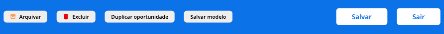

- **Arquivar**: move a oportunidade para um estado inativo, sem excluí-la permanentemente.
- **Excluir**: envia a oportunidade para a lixeira.
- **Duplicar Oportunidade**: cria uma cópia da chamada pública.
- **Salvar Modelo**: guarda a estrutura da oportunidade para reutilização futura.
- **Salvar**: registra as alterações feitas.
- **Salvar e Publicar**: publica a oportunidade para o público, conforme as datas configuradas.
- **Sair**: fecha a tela de edição.

### Seções, blocos e campos

Dentro de cada aba, as informações aparecem agrupadas por tema.

No exemplo abaixo, a aba **Informações** está organizada em seções e blocos:

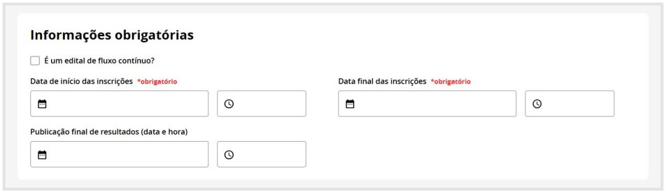

E, dentro desses blocos, estão os campos em que o gestor preenche ou ajusta os dados da chamada pública:

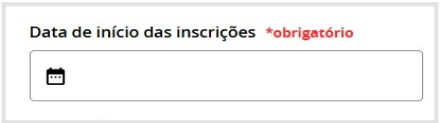

---

## Primeira aba: Informações

A aba **Informações** concentra os dados principais da oportunidade. Em geral, ela reúne:

- informações obrigatórias da chamada pública
- conteúdos de apresentação para o público
- anexos e links complementares
- dados administrativos no painel lateral

Ela costuma ser o primeiro lugar onde o gestor revisa a oportunidade antes de avançar para a configuração das fases.

---

### Informações obrigatórias

Nesta seção ficam os campos essenciais para identificar e apresentar a oportunidade.

#### Datas

Este bloco reúne os campos de período e horário da oportunidade, incluindo abertura e encerramento das inscrições.

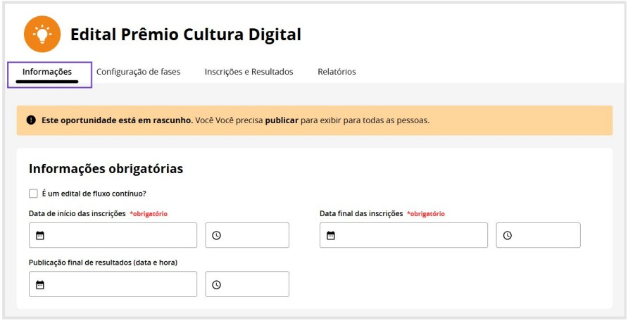

Defina com atenção:

- data de início das inscrições
- data final das inscrições
- horários correspondentes

Se a chamada pública não tiver prazo fixo de encerramento, a plataforma pode permitir marcar a opção de **Fluxo Contínuo**.

#### Nome

O campo **Nome** é obrigatório e deve conter o título oficial da oportunidade.

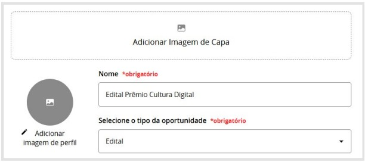

Prefira um nome claro, objetivo e fácil de identificar na busca e na listagem pública.

#### Descrição curta

Use a **Descrição curta** para apresentar rapidamente a chamada pública.

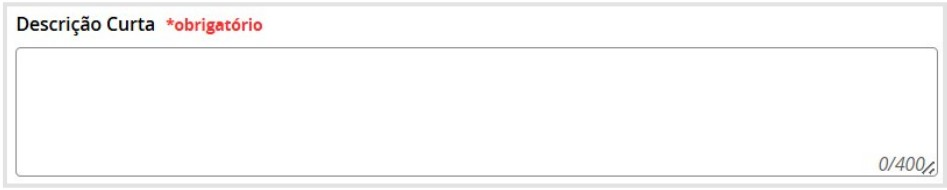

Esse texto aparece como resumo inicial da oportunidade, então vale destacar o objetivo do edital e o público a que ele se destina.

#### Descrição longa

Na **Descrição longa**, você pode detalhar melhor a chamada pública.

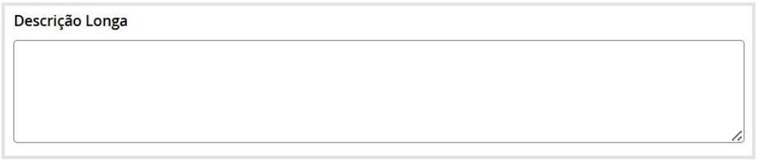

Esse espaço pode incluir:

- objetivo da oportunidade
- quem pode participar
- etapas do processo seletivo
- regras principais
- orientações gerais para inscrição

#### Adicionar arquivos

Nesta área, você pode anexar documentos complementares da chamada pública.

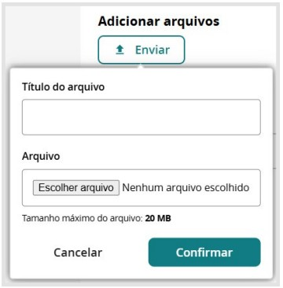

Exemplos:

- edital ou regulamento em PDF
- anexos obrigatórios
- modelos de declaração
- materiais de apoio

#### Adicionar links

Também é possível inserir links externos relacionados à oportunidade.

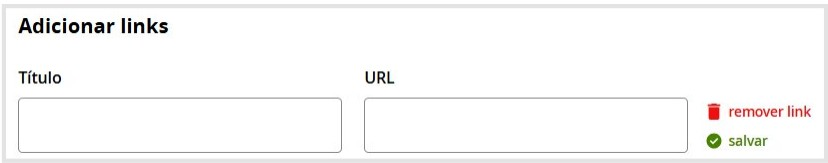

Esses links podem apontar para:

- páginas institucionais
- vídeos explicativos
- formulários complementares
- materiais de referência

#### Galeria de vídeo

Se houver vídeos de apresentação ou orientação, eles podem ser adicionados nesta seção.

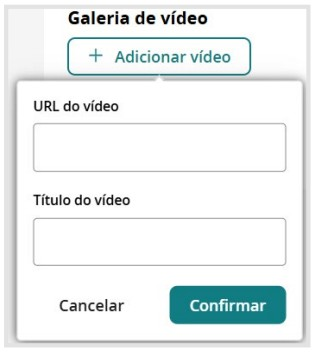

#### Galeria de fotos

Esta seção permite incluir imagens de apoio à divulgação da oportunidade.

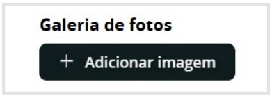

Você pode usar, por exemplo:

- peças gráficas da chamada pública
- imagens de edições anteriores
- logos institucionais

---

### Painel lateral de administração

Além das informações principais, a oportunidade também conta com um painel lateral de administração, usado para complementar a configuração e a gestão da chamada pública.

#### Área de interesse e entidade vinculada

Esses dados são definidos na criação inicial da oportunidade, mas podem ser atualizados depois.

Aqui você pode revisar:

- áreas de interesse da chamada pública
- entidade vinculada à oportunidade

Manter essas informações corretas ajuda na classificação da oportunidade e melhora a experiência de busca para os proponentes.

#### Adicionar regulamento

Neste campo, o gestor pode enviar o documento oficial da chamada pública, com as regras, critérios e diretrizes de participação.

#### Administrado por

O item **Administrado por** indica quem são as pessoas responsáveis pela gestão da oportunidade dentro da plataforma.

É possível adicionar um ou mais administradores, conforme a organização da equipe.

#### Agentes relacionados

Aqui você pode vincular agentes ou instituições diretamente ligados à chamada pública.

#### Redes sociais

Neste espaço, podem ser adicionados links para canais de divulgação e comunicação, como perfis institucionais e páginas relacionadas ao edital.

#### Tags

As tags ajudam a categorizar a oportunidade e facilitam sua localização por palavras-chave.

Use termos que descrevam bem a chamada pública, como:

- edital de fomento
- premiação cultural
- festival
- formação artística

#### Publicado por

Esse campo indica quem cadastrou a oportunidade na plataforma.

#### Alterar propriedade

Se houver mudança de responsável, a propriedade da oportunidade pode ser transferida para outro usuário autorizado.

---

## Próximas etapas do gerenciamento

Depois de revisar e preencher a aba **Informações**, siga para as próximas etapas do fluxo:

1. [Configuração de Fases](./configuracao-fases)
2. [Inscrições e Resultados](./inscricoes-resultados)
3. [Relatórios](./relatorios)
