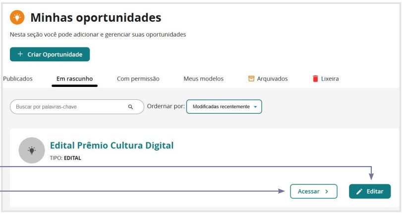
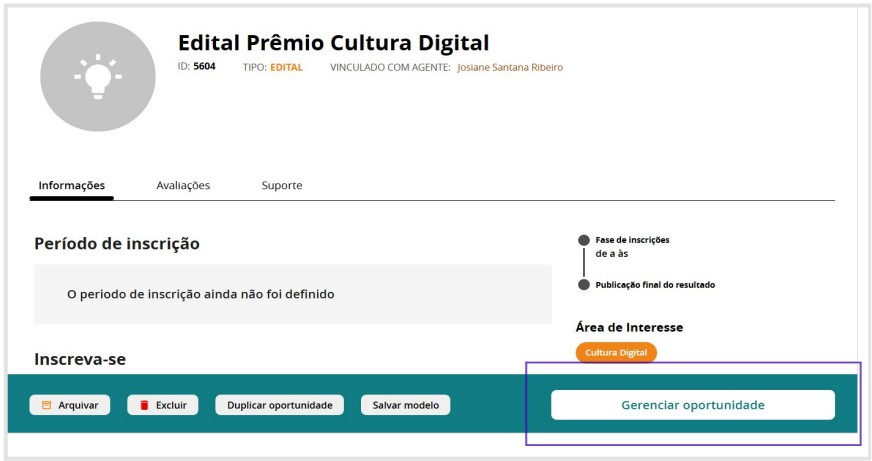
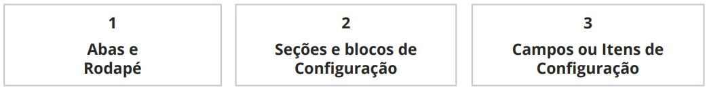
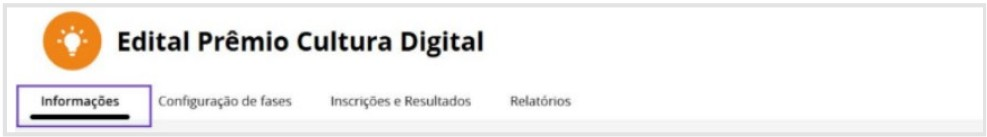
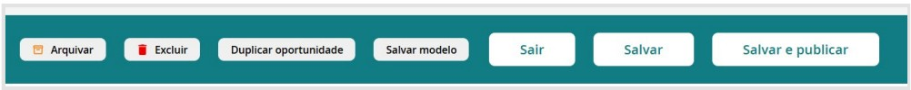

## Gerenciando uma oportunidade / chamada pública criada

Para gerenciar uma oportunidade criada, é importante que ela tenha sido inicialmente criada (consulte o item 1 para saber como criar).

Agora, será necessário configurá-la.

Você pode visualizá-la diretamente no pop-up de criação em **“completar informações”** ou acessá-la no **Painel de Controle**, na seção **“Oportunidades em Rascunho”**, conforme detalhamento abaixo.

> Observe que a **Oportunidade** está na aba **“rascunho”**, ou seja, ainda não foi publicada.

- Há duas opções em todas as oportunidades: 

Você pode **acessar as informações** ou **editar as informações**.

1. Ao clicar em **“Editar”**, você será direcionado para o gerenciamento da oportunidade.  
2. Ao clicar em **“Acessar”**, você encontrará a seguinte tela, que é a visualização de como ficará a chamada pública:

Para editar a partir da página da oportunidade criada, você deverá clicar em **“gerenciar oportunidade”**.

> A seguir, explicamos como a Plataforma organiza as Oportunidades.

## Como está organizado o Cult Editais em Oportunidades

Antes de abordarmos diretamente o gerenciamento de editais na plataforma, é fundamental compreender como ela está organizada.

O Cult Editais estrutura a criação e o gerenciamento de oportunidades de forma organizada, permitindo que usuários configurem editais e processos seletivos.

Para isso, a plataforma está dividida em três níveis principais:

A seguir, explicamos detalhadamente cada um desses elementos.

---

### Abas

As abas são as divisões principais dentro da página de gerenciamento de oportunidades. Elas funcionam como áreas de navegação, permitindo que o usuário acesse diferentes conjuntos de configurações.

No Cult Editais, o gerenciamento das oportunidades é organizado em quatro abas principais, que facilitam a configuração e acompanhamento da chamada pública:

1. **Aba “Informações”**  
Área onde são cadastradas as principais informações da oportunidade, como nome, descrição, datas, entidade vinculada, regulamentos e anexos.

2. **Aba “Configuração de Fases”**  
Permite configurar as fases da chamada pública, como inscrição, avaliações e publicação dos resultados.

3. **Aba “Inscrições e Resultados”**  
Área em que são gerenciadas e acompanhadas as inscrições, as avaliações e publicação do resultado.

4. **Aba “Relatórios”**  
Área destinada à análise de dados da oportunidade, permitindo a geração de relatórios sobre inscritos, selecionados e demais métricas.

---

### Rodapé da Oportunidade

No gerenciamento da Oportunidade haverá sempre o **rodapé de ações rápidas** que facilita o gerenciamento. Confira suas funções:

1. **Arquivar**  
Move a oportunidade para um estado inativo, retirando-a da listagem pública sem excluí-la permanentemente.

2. **Excluir**  
Remove a oportunidade de forma definitiva. A oportunidade ficará na lixeira.

3. **Duplicar Oportunidade**  
Cria uma cópia idêntica da oportunidade, útil para reaproveitar oportunidades anteriores.

4. **Salvar Modelo**  
Permite salvar a estrutura da oportunidade como um modelo, facilitando a criação de novas oportunidades similares no futuro.

5. **Sair**  
Sai da tela de edição sem salvar alterações recentes.

6. **Salvar**  
Armazena as edições feitas.

7. **Salvar e Publicar**  
Finaliza o cadastro e torna a oportunidade visível ao público, permitindo inscrições conforme o período definido.

---

### Seções e blocos de configuração

Dentro de cada aba, há grupos específicos de configurações organizados por temas. Esses grupos são chamados de **“seções”**, algumas seções possuem um único **“bloco de configuração”**, pois reúnem itens relacionados dentro de uma mesma categoria.

Por exemplo, dentro da aba **“Informações”**, há o seguinte bloco de informações de data dentro da seção de **“informações obrigatórias”**:

---

### Campos e itens de configuração

Cada seção contém elementos interativos onde o usuário insere ou seleciona informações.  
Esses elementos são chamados de **“campos”**, **“itens de configuração”** ou **“opções de configuração”**.

No exemplo abaixo, os campos são os quadros para inserção das informações:

Agora que você já compreende como as **“Oportunidades”** estão organizadas, vamos explorar cada uma das abas, detalhando as seções e os campos disponíveis em cada etapa do processo.

---

## Primeira aba: Informações

A Aba **“Informações”** foi estruturada com duas seções principais:

- **1ª Seção: Informações obrigatórias** – Com dois blocos de configuração de campos essenciais que definem o período de inscrições e demais opções de configuração obrigatórias e complementares, permitindo um preenchimento mais detalhado sobre a oportunidade.

- **2ª Seção: Painel lateral** – Contém opções adicionais para o gerenciamento da chamada pública, como configuração de administradores, agentes relacionados, redes sociais e publicação.

A seguir, cada uma dessas seções será apresentada em detalhes.

---

### 1ª seção: Informações obrigatórias

#### 1° Bloco de configuração - Datas

Este bloco reúne os campos para definir as datas e horários da oportunidade, incluindo: Início e término das inscrições e Publicação do resultado final.  

Essas informações são fundamentais para garantir o correto funcionamento da chamada pública, estabelecendo prazos para os participantes.

Defina o período de inscrição informando as datas de abertura e encerramento da chamada pública.  
Esse prazo determina o período em que os agentes artísticos poderão submeter suas propostas.  

Se a oportunidade não tiver um prazo fixo de encerramento, marque a opção **“Fluxo Contínuo”**, permitindo inscrições abertas de forma permanente.

---

#### 2° Bloco de configuração

Neste bloco, são inseridas as informações principais da oportunidade. A seguir, detalharei cada um desses campos, explicando sua importância e como preenchê-los corretamente.

---

##### A - Nome

Este campo é obrigatório e deve conter o título oficial da oportunidade.  
Escolha um nome claro e objetivo, que represente bem o propósito da chamada pública.  
Evite títulos muito longos ou genéricos, para facilitar a identificação e pesquisa da oportunidade na plataforma.

---

##### B - Descrição Curta

Aqui, você deve inserir um resumo da chamada pública em poucas palavras. Esse texto será exibido como um destaque inicial para os usuários, então deve ser direto e informativo, apresentando os principais objetivos e públicos-alvo da oportunidade.

---

##### C - Descrição Longa

Utilize este espaço para fornecer informações detalhadas sobre a oportunidade. A descrição pode incluir:

- ☑ O objetivo da chamada pública e quem pode participar.  
- ☑ Critérios de avaliação e seleção.  
- ☑ Etapas do processo seletivo.  
- ☑ Informações sobre prêmios, bolsas ou incentivos oferecidos.

---

##### D - Adicionar Arquivos

Nesta seção, você pode anexar documentos complementares à chamada pública, como:

- Regulamentos em PDF  
- Modelos de formulários ou anexos obrigatórios  
- Guias e materiais explicativos  

Os arquivos anexados ficarão disponíveis para download pelos interessados.

---

##### E - Adicionar Links

Aqui, você pode incluir links externos relevantes, como:

- ☑ Página oficial da chamada pública.  
- ☑ Formulários de inscrição externos.  
- ☑ Vídeos explicativos ou materiais complementares.  

Certifique-se de que os links estão corretos e direcionam para conteúdos acessíveis ao público.

---

##### F - Galeria de Vídeo

Os vídeos devem estar hospedados em plataformas externas (como YouTube ou Vimeo) e ser incorporados via link.

Se houver vídeos informativos sobre a chamada pública, utilize este espaço para adicioná-los. Os vídeos podem ser:

- ☑ Apresentações sobre a oportunidade.  
- ☑ Depoimentos de participantes anteriores.  
- ☑ Explicações detalhadas sobre o processo de inscrição.

---

##### G - Galeria de Fotos

Nesta seção, é possível adicionar imagens que ilustrem a oportunidade, como:

- ☑ Artes gráficas da chamada pública.  
- ☑ Registros de edições anteriores.  
- ☑ Logos institucionais ou marcas de apoio.

---

### Lateral de Administração

Na lateral de administração temos um bloco com os seguintes campos:

### Área de interesse e entidade vinculada

Esses foram os itens cadastrados no início da criação da oportunidade. Neste espaço, você pode atualizar, trocar ou adicionar novas áreas de interesse, além de editar a entidade vinculada à chamada pública.

> Lembre-se de que é essencial definir e manter essas informações sempre atualizadas e corretas, pois elas garantem a classificação adequada da chamada pública e facilitam sua associação aos agentes e instituições responsáveis, aumentando a precisão das buscas e a transparência do processo.

### Adicionar Regulamento

Este campo permite o upload do documento oficial da chamada pública, contendo todas as regras e diretrizes para participação. Certifique-se de que o regulamento está atualizado e acessível, pois será a principal referência para os candidatos.

### Administrado por

Ainda no menu lateral você encontra o item **“administrado por”**.

Indique quem é o responsável pela gestão da chamada pública dentro da plataforma. É possível adicionar um ou mais administradores, que terão permissão para editar as informações da oportunidade e acompanhar as inscrições.

### Agentes Relacionados

Aqui, você pode vincular agentes artísticos ou instituições que estejam diretamente ligados à oportunidade. Os agentes adicionados terão seus perfis conectados à chamada pública dentro da plataforma.

### Redes Sociais

Adicione links para perfis e páginas nas redes sociais relacionadas à chamada pública, como:

- ☑ Facebook, Instagram, Twitter.  
- ☑ Grupos de WhatsApp ou Telegram para tirar dúvidas.  
- ☑ Canais no YouTube para divulgação de vídeos explicativos.  

Isso facilita o engajamento do público e amplia a divulgação da oportunidade.

### Tags

As tags ajudam a categorizar a oportunidade dentro da plataforma, facilitando a busca por palavras-chave. Adicione termos relevantes, como:

- ☑ “Edital de fomento”  
- ☑ “Bolsa de pesquisa”  
- ☑ “Festival de música”  

Quanto mais bem definidas forem as tags, maior será a visibilidade da chamada pública na plataforma.

### Publicado por

Indica quem realizou o cadastro da oportunidade na plataforma. Esse campo é útil para rastrear a origem da chamada pública e manter a transparência na gestão das informações.

### Alterar Propriedade

Caso seja necessário, o administrador pode transferir a propriedade da chamada pública para outro usuário responsável. Essa opção é útil quando há mudanças na equipe de gestão ou redistribuição de funções dentro da organização.
