## Gerenciando uma oportunidade criada

Depois de criar uma oportunidade, o próximo passo é revisar, complementar e organizar todas as informações antes da publicação.

Se você ainda não criou a oportunidade, consulte a página [Criar Oportunidade](./criar-oportunidade).

Você pode chegar à tela de gerenciamento de duas formas:

1. Logo após a criação, clicando em **Completar informações**.
2. Pelo **Painel de Controle**, na seção **Ente Federado** > **Oportunidades**, acessando a aba em que a oportunidade está salva.

> Quando a oportunidade aparece na aba **Em rascunho**, isso significa que ela já foi criada, mas ainda não foi publicada para o público.

---

## Acessar ou editar a oportunidade

Na listagem de oportunidades, cada item costuma oferecer pelo menos duas ações principais:

- **Acessar**: abre a visualização pública da oportunidade, mostrando como ela será apresentada aos proponentes.
- **Editar**: abre a tela de gerenciamento para configurar os dados da chamada pública.

Ao clicar em **Acessar**, você verá a página pública da oportunidade:

Se quiser voltar para a edição a partir dessa visualização, clique em **Gerenciar oportunidade**.

---

## Como a tela de gerenciamento está organizada

Antes de preencher os campos, vale entender como a plataforma organiza a edição da oportunidade.

O gerenciamento é estruturado em níveis que ajudam a localizar cada informação com mais facilidade:

- **Abas**: dividem a tela em grandes áreas de trabalho.
- **Seções e blocos**: agrupam informações relacionadas dentro de cada aba.
- **Campos e itens de configuração**: são os espaços em que você preenche, seleciona ou envia informações.

### Abas principais

O Cult Editais organiza o gerenciamento das oportunidades em quatro abas:

1. **Informações**
2. **Configuração de Fases**
3. **Inscrições e Resultados**
4. **Relatórios**

Nesta página, vamos tratar da aba **Informações** e da estrutura geral da tela.

As demais abas têm páginas próprias no manual:

- [Configuração de Fases](./configuracao-fases)
- [Inscrições e Resultados](./inscricoes-resultados)
- [Relatórios](./relatorios)

### Rodapé da oportunidade

Na tela de gerenciamento, a plataforma mantém um rodapé com ações rápidas:

- **Arquivar**: move a oportunidade para um estado inativo, sem excluí-la permanentemente.
- **Excluir**: envia a oportunidade para a lixeira.
- **Duplicar Oportunidade**: cria uma cópia da chamada pública.
- **Salvar Modelo**: guarda a estrutura da oportunidade para reutilização futura.
- **Salvar**: registra as alterações feitas.
- **Salvar e Publicar**: publica a oportunidade para o público, conforme as datas configuradas.
- **Sair**: fecha a tela de edição.

---

## Informações da oportunidade

A aba **Informações** concentra os dados principais da oportunidade. Em geral, ela reúne:

- informações obrigatórias da chamada pública
- conteúdos de apresentação para o público
- anexos e links complementares
- dados administrativos no painel lateral

Ela costuma ser o primeiro lugar onde o gestor revisa a oportunidade antes de avançar para a configuração das fases.

---

### Informações obrigatórias

Nesta seção ficam os campos essenciais para identificar e apresentar a oportunidade.

#### Datas

Este bloco reúne os campos de período e horário da oportunidade, incluindo abertura e encerramento das inscrições.

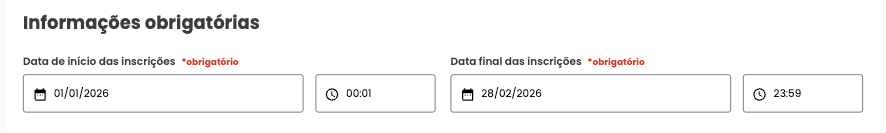

Defina com atenção:

- data de início das inscrições
- data final das inscrições
- horários correspondentes

#### Imagem de capa

A **imagem de capa** é a arte horizontal que aparece em destaque na apresentação da oportunidade.

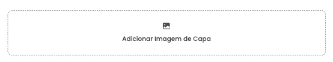

Ao fazer o upload, prefira uma imagem no tamanho:

- **1170 x 390 px**

Use uma imagem com boa legibilidade, sem excesso de texto e com elementos visuais que representem a chamada pública.

#### Imagem de perfil

A **imagem de perfil** funciona como a identificação visual principal da oportunidade em alguns pontos da plataforma.

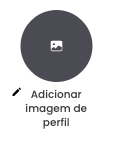

Ao fazer o upload, prefira uma imagem no tamanho:

- **400 x 400 px**

Dê preferência a uma imagem quadrada, centralizada e com boa resolução, para evitar cortes inadequados.

#### Nome

O campo **Nome** é obrigatório e deve conter o título oficial da oportunidade.

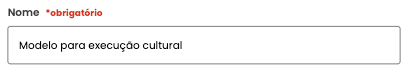

Prefira um nome claro, objetivo e fácil de identificar na busca e na listagem pública.

#### Tipo de edital

No campo **Tipo de edital**, selecione a modalidade que corresponde à chamada pública que está sendo configurada.

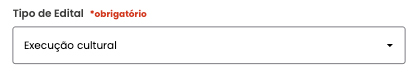

Essa definição ajuda a classificar corretamente a oportunidade na plataforma e orienta o preenchimento das etapas seguintes.

#### Descrição curta

Use a **Descrição curta** para apresentar rapidamente a chamada pública.

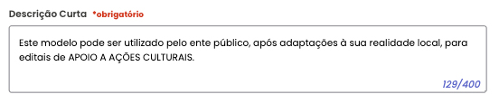

Esse texto aparece como resumo inicial da oportunidade, então vale destacar o objetivo do edital e o público a que ele se destina.

#### Descrição longa

Na **Descrição longa**, você pode detalhar melhor a chamada pública.

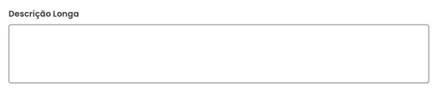

Esse espaço pode incluir:

- objetivo da oportunidade
- quem pode participar
- etapas do processo seletivo
- regras principais
- orientações gerais para inscrição

#### Segmento artístico-cultural

O campo **Segmento artístico-cultural** é obrigatório e permite indicar a quais segmentos a oportunidade se destina.

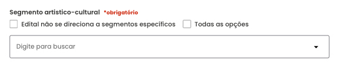

Caso a chamada pública não seja voltada a segmentos específicos, selecione a opção **"Edital não se direciona a segmentos específicos"**.

Se necessário, use o campo **"Digite para buscar"** para localizar as opções disponíveis.

#### Pauta temática

O campo **Pauta temática** é obrigatório e serve para indicar se a oportunidade está relacionada a temas específicos.

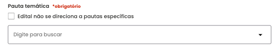

Caso a chamada pública não seja direcionada a pautas específicas, selecione a opção **"Edital não se direciona a pautas específicas"**.

Use o campo **"Digite para buscar"** para localizar a opção desejada.

#### Etapa do fazer cultural

O campo **Etapa do fazer cultural** é obrigatório e ajuda a identificar em qual etapa a oportunidade se aplica.

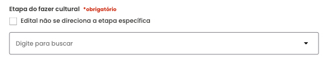

Caso o edital não se direcione a uma etapa específica, selecione a opção **"Edital não se direciona a etapa específica"**.

Você também pode utilizar o campo **"Digite para buscar"** para encontrar a opção adequada.

#### Território

O campo **Território** é obrigatório e permite indicar o recorte territorial da chamada pública.

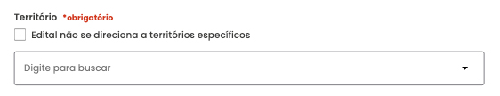

Caso o edital não seja direcionado a territórios específicos, selecione a opção **"Edital não se direciona a territórios específicos"**.

Use o campo **"Digite para buscar"** para localizar as opções disponíveis.

#### Houve utilização de recursos de outras fontes?

O campo **Houve utilização de recursos de outras fontes?** é obrigatório e informa se, além dos recursos deste ciclo da **Política Aldir Blanc**, o edital também utilizará outras fontes de financiamento.

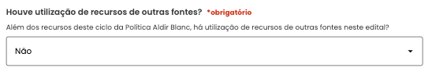

Se a resposta for **Sim**, será necessário preencher o campo **Detalhamento dos recursos**, também obrigatório.

> Atenção: selecione pelo menos uma fonte de recurso para continuar.

As opções disponíveis incluem:

- **Recursos próprios**
- **Convênios/parcerias com entes federativos**
- **Emendas parlamentares**
- **Recursos remanescentes do ciclo 1**
- **Recursos de outras fontes**

#### Este edital receberá inscrições por outros meios?

O campo **Este edital receberá inscrições por outros meios?** é obrigatório e serve para indicar se, além da inscrição pela plataforma, haverá outros canais de recebimento.

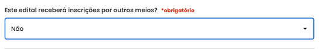

Se a resposta for **Sim**, será necessário preencher o campo **Opções de formas de inscrição**, também obrigatório.

> Selecione pelo menos uma forma de inscrição para continuar.

As opções disponíveis incluem:

- **E-mail**
- **Presencial**
- **Correspondência**
- **Oralidade**
- **Outros**

#### Outras modalidades de ações afirmativas

O campo **Outras modalidades de ações afirmativas** é obrigatório e permite indicar se o edital prevê ações afirmativas complementares.

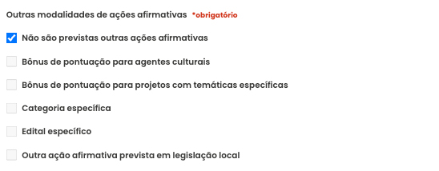

Caso não haja previsão, selecione a opção **Não são previstas outras ações afirmativas**.

As opções disponíveis incluem:

- **Bônus de pontuação para agentes culturais**
- **Bônus de pontuação para projetos com temáticas específicas**
- **Categoria específica**
- **Edital específico**
- **Outra ação afirmativa prevista em legislação local**

#### Adicionar arquivos

Nesta área, você pode anexar documentos complementares da chamada pública.

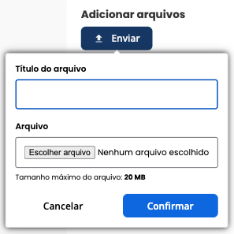

Exemplos:

- edital ou regulamento em PDF
- anexos obrigatórios
- modelos de declaração
- materiais de apoio

#### Adicionar links

Também é possível inserir links externos relacionados à oportunidade.

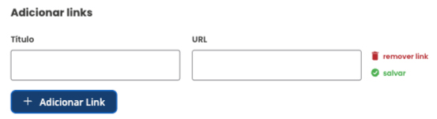

Esses links podem apontar para:

- páginas institucionais
- vídeos explicativos
- materiais de referência

#### Galeria de vídeo

Se houver vídeos de apresentação ou orientação, eles podem ser adicionados nesta seção.

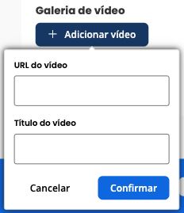

#### Galeria de fotos

Esta seção permite incluir imagens de apoio à divulgação da oportunidade.

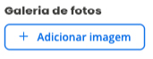

Você pode usar, por exemplo:

- peças gráficas da chamada pública
- imagens de edições anteriores
- logos institucionais

---

### Painel lateral de administração

Além das informações principais, a oportunidade também conta com um painel lateral de administração, usado para complementar a configuração e a gestão da chamada pública.

#### Área de interesse

No campo **Área de Interesse**, você pode revisar as áreas já vinculadas à oportunidade e, se necessário, clicar em **Adicionar nova** para incluir outras classificações.

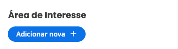

Esse preenchimento ajuda a categorizar corretamente o edital e melhora sua organização dentro da plataforma.

#### Entidade vinculada

No campo **Entidade Vinculada**, a plataforma exibe a entidade responsável pela chamada pública. Em geral, ela aparece vinculada ao responsável pelo cadastro.

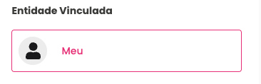

#### Adicionar regulamento

O campo **Adicionar regulamento** é obrigatório e deve receber o arquivo oficial da chamada pública em PDF.

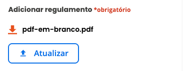

Após selecionar o documento, a plataforma exibirá o nome do arquivo enviado, e disponibilizará a opção **Atualizar** para substituir o arquivo, se necessário.

#### Administrado por

No item **Administrado por**, você define quem poderá gerenciar a oportunidade dentro da plataforma.

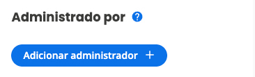

Se necessário, clique em **Adicionar administrador** para incluir outras pessoas responsáveis pela edição e acompanhamento da chamada pública.

#### Redes sociais

Nesta seção, você pode preencher os identificadores das redes sociais relacionadas ao edital.

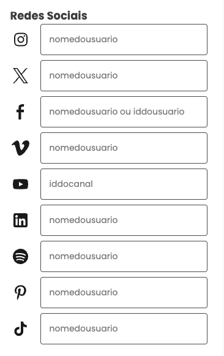

Dependendo da rede, a plataforma pode solicitar:

- `nomedousuario`
- `nomedousuario ou iddousuario`
- `iddocanal`

Preencha essas informações conforme o padrão exigido por cada rede, para que os links de divulgação funcionem corretamente.

#### Tags

As **Tags** ajudam a categorizar a oportunidade e facilitam sua localização por palavras-chave.

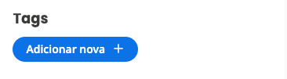

Se necessário, clique em **Adicionar nova** para incluir mais termos relacionados ao edital.

#### Publicado por / Alterar propriedade

Nesse mesmo campo, a plataforma informa quem cadastrou a oportunidade em **Publicado por**. Em geral, esse dado aparece vinculado ao perfil atual.

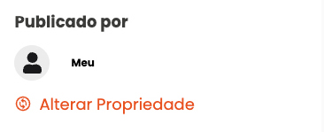

Se houver mudança de responsável, a opção **Alterar propriedade** permite transferir a oportunidade para outro usuário autorizado.

---

## Próximas etapas do gerenciamento

Depois de revisar e preencher a aba **Informações**, siga para as próximas etapas do fluxo:

1. [Configuração de Fases](./configuracao-fases)
2. [Inscrições e Resultados](./inscricoes-resultados)
3. [Relatórios](./relatorios)
