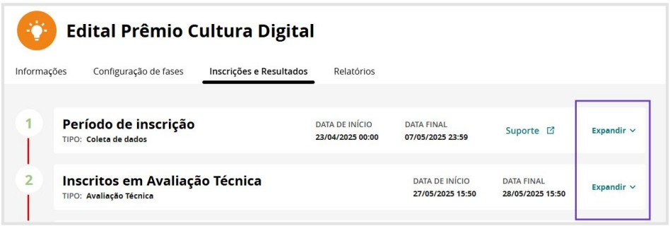
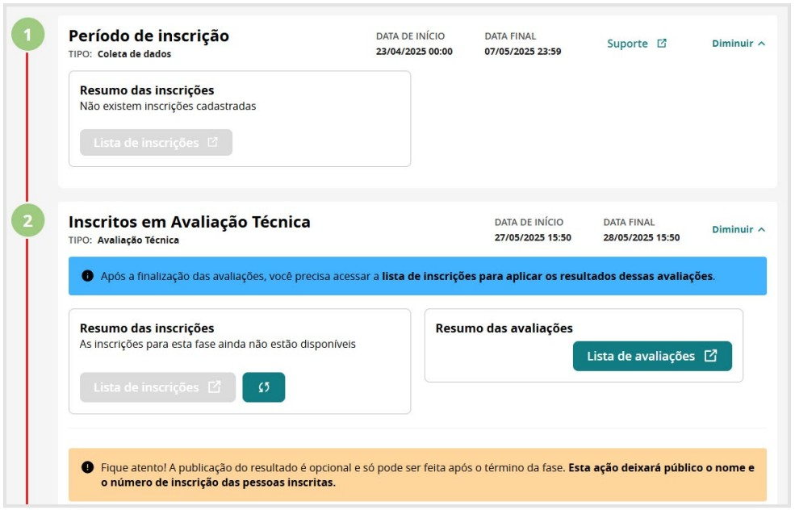
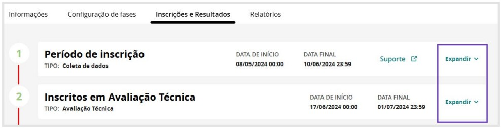
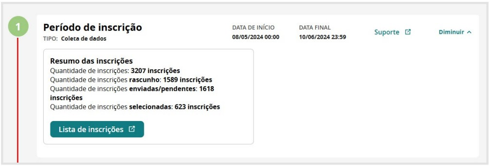
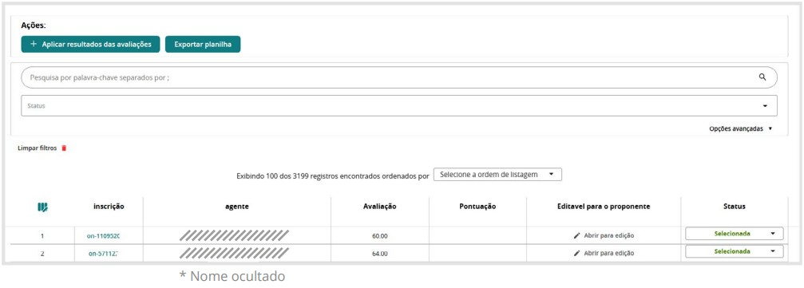
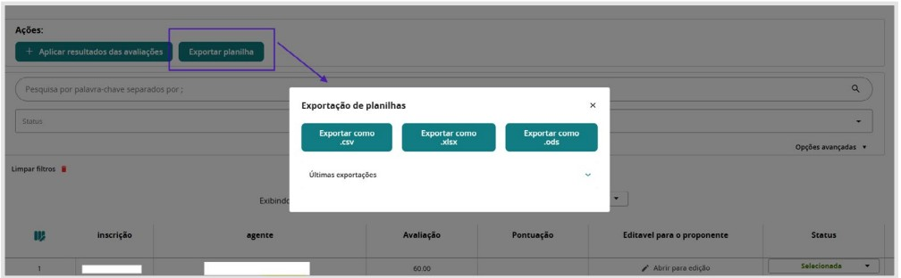
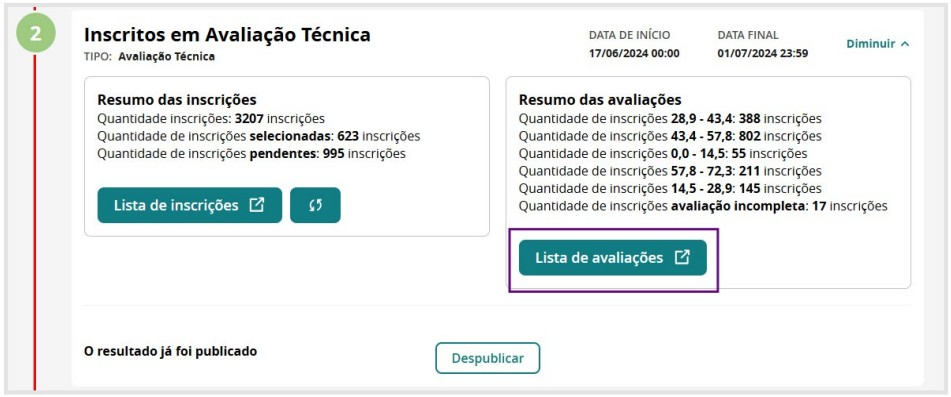
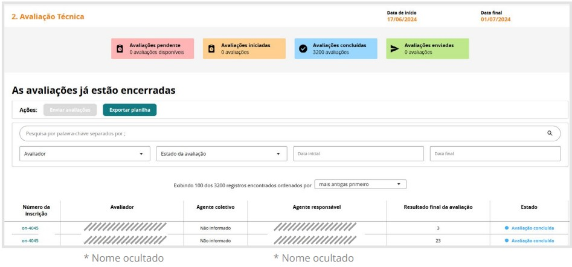
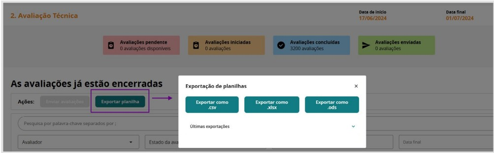

## Aba Inscrições e Resultados

A aba **Inscrição e Resultados** serve para o **acompanhamento das fases**.  
Clicando em **expandir**, você acessa as informações da fase configurada.

Abaixo apresento o **acompanhamento de fase** de uma seleção recém configurada e ainda **sem inscrição**. Observe que **não há inscrições para acompanhamento**:

Agora observe um exemplo de um **Edital totalmente construído pela plataforma**, que foi o **Edital de Agentes Territoriais de Cultura do Nordeste**:

---

### Acompanhar a Fase de Inscrição

Ao clicar em **Lista de Inscrições**, sou redirecionada a uma página em que é possível acessar **todas as inscrições**, com **opções de filtros para pesquisa**:

Ao clicar em **“Exportar planilha”**, tenho acesso a **todos os dados dos inscritos** nos seguintes formatos:

---

### Acompanhar a Fase de Avaliação

Ao clicar em **Lista de Avaliações**, é possível acompanhar o **processo de avaliação da Comissão de Seleção**.

> **Observação:**  
> A informação sobre **inscrições pendentes e incompletas** refere-se aos candidatos que realizaram **mais de uma inscrição** no certame.  
> 
> Nesses casos, a comissão de avaliação **considerou apenas a última inscrição enviada pelo candidato**, desconsiderando as anteriores.  
> 
> Esse procedimento garante que **cada participante tenha apenas uma candidatura válida** dentro do processo seletivo.

> **Observação:** Os nomes dos avaliadores, agentes e parte da inscrição estão ocultados no tutorial.

Da mesma maneira que na inscrição, é possível exportar planilha com os dados nos seguintes formatos: 

---

