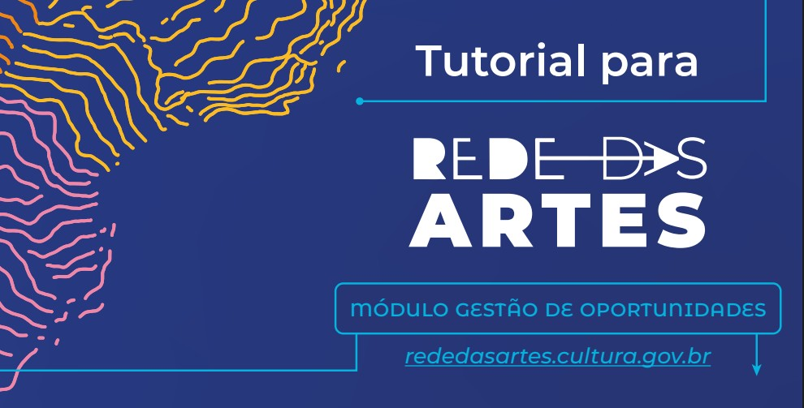

# Manual do Gestor – Plataforma Rede das Artes

## Apresentação

A Fundação Nacional de Artes apresenta o **Tutorial da Plataforma Rede das Artes**, uma iniciativa da Funarte, desenvolvida em parceria com o **Laboratório do Futuro da Universidade Federal do Ceará**, que visa fortalecer a difusão das artes no Brasil por meio de um ambiente digital colaborativo e acessível.

A plataforma reúne agentes, coletivos, artistas, produtores e gestores, conectando **perfis, projetos, eventos e espaços artísticos** de todo o país.

Com funcionalidades que permitem aos próprios usuários atualizarem seus dados e criarem ou acessarem oportunidades como **editais, oficinas e intercâmbios**, a plataforma consolida uma **agenda cultural viva e descentralizada**, promovendo **visibilidade, transparência e articulação** entre os diversos setores artísticos.

A plataforma surge como resposta a uma **demanda histórica do setor** por mapeamento e fortalecimento das **políticas públicas para as artes**, especialmente após a descontinuidade dessas iniciativas nos últimos anos.

Além de visibilizar ações apoiadas pela Funarte, como o **Programa de Difusão Nacional** e o **Programa de Apoio a Ações Continuadas**, a plataforma contribui para a retomada da **Política Nacional das Artes** e para a construção de uma **infraestrutura digital pública voltada às artes**, com foco na **inclusão, participação e valorização** da produção artística brasileira.

Para usufruir de todos os benefícios da plataforma, acesse:

👉 [https://rededasartes.cultura.gov.br](https://rededasartes.cultura.gov.br)

Crie ou atualize seu perfil e insira os dados de seus projetos inscritos em editais lançados pela Funarte e as ações a eles associadas na Plataforma.

Essas informações servirão de **referência e modelo** para toda a comunidade da Rede das Artes e contribuirão para **ampliar sua visibilidade** e criar **novas oportunidades de diálogo e circulação**.

> **Bem-vindos(as/es) à Rede das Artes!**

--------

# 1. Como cadastrar uma oportunidade / chamada pública

## Bem-vindo(a) ao Módulo do Gestor!

Você está iniciando a fase de **gerenciamento de oportunidades** dentro da **Rede das Artes**.

Neste módulo, você aprenderá a **cadastrar, administrar e acompanhar oportunidades**, como:

- Editais  
- Chamadas públicas  
- Premiações

Garantindo que todo o processo seja conduzido de forma **transparente e eficiente**.

---

## 🛠️ O que envolve o gerenciamento de uma oportunidade?

O gerenciamento de uma oportunidade inclui:

- O **cadastro inicial**
- A **configuração das etapas**
- A **publicação do resultado final**

Essas ações permitem que os gestores tenham um **controle mais organizado sobre os processos seletivos**.

---

## ✅ Funcionalidades principais

Ao utilizar o Módulo do Gestor, você poderá:

- ☑ **Estruturar uma oportunidade**  
- ☑ **Definir critérios de seleção e avaliação**  
- ☑ **Definir e configurar as fases de seleção**  
- ☑ **Acompanhar inscrições e avaliações**  
- ☑ **Gerar relatórios de acompanhamento** da sua oportunidade

---

## 👤 Para quem é este módulo?

Se você é **gestor** ou **responsável por uma chamada pública**, este módulo foi feito para você.

Siga os próximos passos para **cadastrar e gerenciar sua oportunidade** de forma eficaz na plataforma Rede das Artes.

---

## 🚀 Vamos começar?

