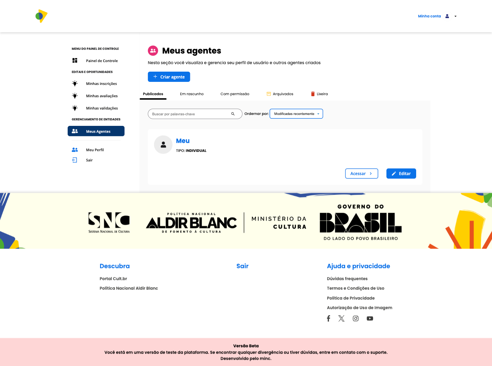
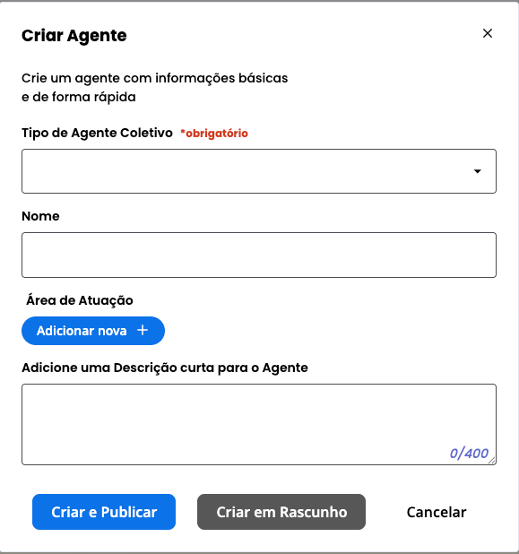
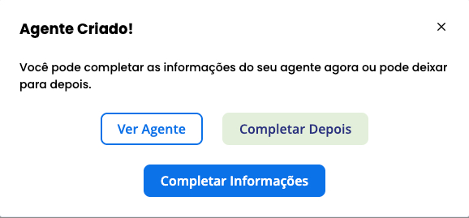
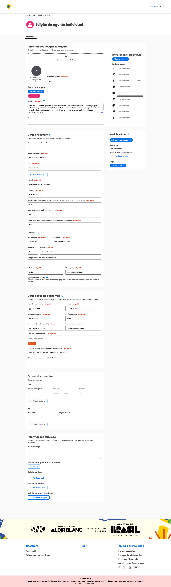
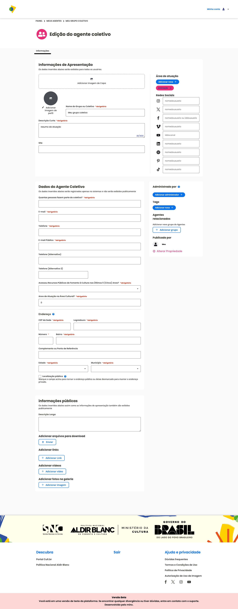

### Meus Agentes

Nesta seção você visualiza e gerencia seu perfil de usuário e outros agentes criados.

---

#### Tipos de agente

A plataforma oferece dois tipos de agente:

- **Agente Individual** — vinculado ao seu CPF, criado automaticamente no momento do cadastro da conta. É único e representa você como pessoa física.
- **Agente Coletivo** — para grupos, companhias, bandas, coletivos e organizações, com ou sem CNPJ. Você pode criar quantos precisar.

---

#### Como criar um agente coletivo

1. Clique em **Criar agente**.

2. No modal, selecione o **tipo de agente coletivo**:
   - **Pessoa jurídica com fins lucrativos**
   - **Pessoa jurídica sem fins lucrativos**
   - **Coletivos e grupos informais**

3. Preencha o **nome** do agente.

4. Selecione a **área de atuação**.

5. Adicione uma **descrição curta**.

6. Clique em **Criar e publicar**.

Será exibido o modal **Agente Criado!** com três opções:

- **Ver agente** — abre o perfil público do agente criado.
- **Completar depois** — fecha o modal e retorna à listagem.
- **Completar informações** — abre a tela de edição do agente. **Recomendado:** use esta opção para preencher todas as informações do agente coletivo.

Após publicar, o agente coletivo aparece listado em **Meus Agentes** e já pode ser utilizado para se inscrever em oportunidades.

---

#### Editar agente individual

O agente individual é o seu perfil pessoal na plataforma. Para editá-lo, acesse **Meus Agentes** e clique em **Editar** no seu agente individual.

---

**Informações de Apresentação**

Dados exibidos publicamente para todos os usuários.

| Campo | Obrigatório | Descrição |
|---|---|---|
| Imagem de capa | — | Banner exibido no topo do perfil |
| Imagem de perfil | — | Foto de rosto ou avatar |
| Nome do agente | ✅ | Nome exibido publicamente |
| Áreas de atuação | — | Segmentos culturais em que atua |
| Mini bio | ✅ | Texto curto de apresentação (até 400 caracteres) |
| Site | — | URL do site pessoal |
| Função na cultura | — | Papel exercido (ex.: produtor, artista) |
| Redes sociais | — | Instagram, Facebook, YouTube, entre outros |

---

**Dados Pessoais**

Dados **não exibidos publicamente** — registrados apenas no sistema.

| Campo | Obrigatório |
|---|---|
| Nome artístico ou nome social | — |
| Nome completo | ✅ |
| CPF | ✅ |
| E-mail | ✅ |
| Telefone | ✅ |
| Acessou recursos públicos de fomento nos últimos 5 anos? | ✅ |
| Anos de atuação na área cultural | ✅ |
| É mestre ou mestra das culturas tradicionais ou populares? | ✅ |

---

**Endereço**

| Campo | Obrigatório |
|---|---|
| CEP | ✅ |
| Logradouro | ✅ |
| Número | ✅ |
| Bairro | ✅ |
| Complemento | — |
| Estado | ✅ |
| Município | ✅ |
| Localização pública | — (marque para tornar o endereço visível no mapa) |

---

**Dados pessoais sensíveis**

Registrados apenas no sistema, **não exibidos publicamente**.

| Campo | Obrigatório |
|---|---|
| Data de nascimento | ✅ |
| Gênero | ✅ |
| Orientação sexual | ✅ |
| Cor/raça/etnia | ✅ |
| Renda média individual | ✅ |
| Escolaridade | ✅ |
| Pessoa com deficiência | ✅ |
| Pertence a povos e comunidades tradicionais | ✅ |

---

**Informações públicas**

| Campo | Descrição |
|---|---|
| Descrição longa | Texto detalhado sobre trajetória e atuação |
| Arquivos para download | Documentos ou materiais disponíveis para o público |
| Links | URLs relevantes (portfolio, projetos etc.) |

---

#### Editar agente coletivo

Para editar um agente coletivo, acesse **Meus Agentes** e clique em **Editar** no agente desejado.

---

**Informações de Apresentação**

Dados exibidos publicamente para todos os usuários.

| Campo | Obrigatório | Descrição |
|---|---|---|
| Imagem de capa | — | Banner exibido no topo do perfil |
| Imagem de perfil | — | Logo ou imagem do grupo |
| Nome do grupo ou coletivo | ✅ | Nome exibido publicamente |
| Descrição curta | ✅ | Resumo da atuação (até 400 caracteres) |
| Site | — | URL do site do grupo |
| Área de atuação | — | Segmentos culturais em que atua |
| Redes sociais | — | Instagram, Facebook, YouTube, entre outros |

---

**Dados do Agente Coletivo**

Dados **não exibidos publicamente** — registrados apenas no sistema.

| Campo | Obrigatório |
|---|---|
| Quantas pessoas fazem parte do coletivo? | ✅ |
| E-mail | ✅ |
| Telefone | ✅ |
| E-mail público | ✅ |
| Telefone alternativo | — |
| Acessou recursos públicos de fomento nos últimos 5 anos? | ✅ |
| Anos de atuação na área cultural | ✅ |

---

**Endereço**

| Campo | Obrigatório |
|---|---|
| CEP | ✅ |
| Logradouro | ✅ |
| Número | ✅ |
| Bairro | ✅ |
| Complemento | — |
| Estado | ✅ |
| Município | ✅ |
| Localização pública | — (marque para tornar o endereço visível no mapa) |

---

**Informações públicas**

| Campo | Descrição |
|---|---|
| Descrição longa | Texto detalhado sobre o grupo e sua atuação |
| Arquivos para download | Documentos ou materiais disponíveis para o público |
| Links | URLs relevantes |
| Tags | Palavras-chave para facilitar a busca |
| Agentes relacionados | Outros agentes vinculados ao coletivo |
| Administradores | Pessoas com permissão para editar o agente |

Após preencher todos os campos desejados, clique em **Salvar**.

