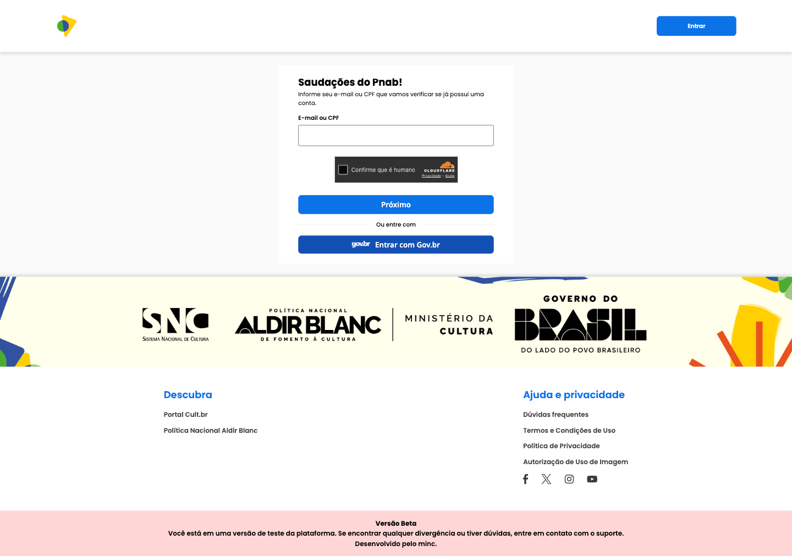
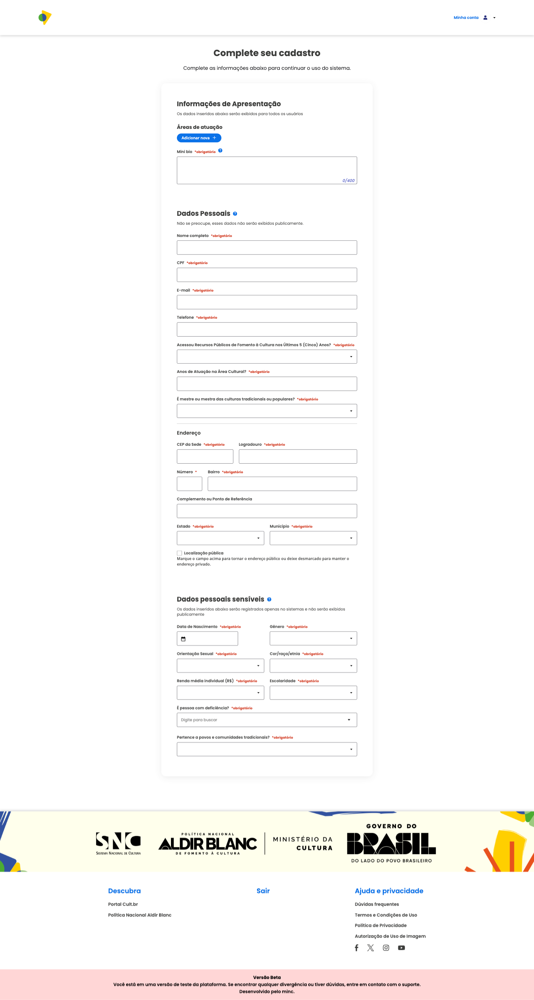
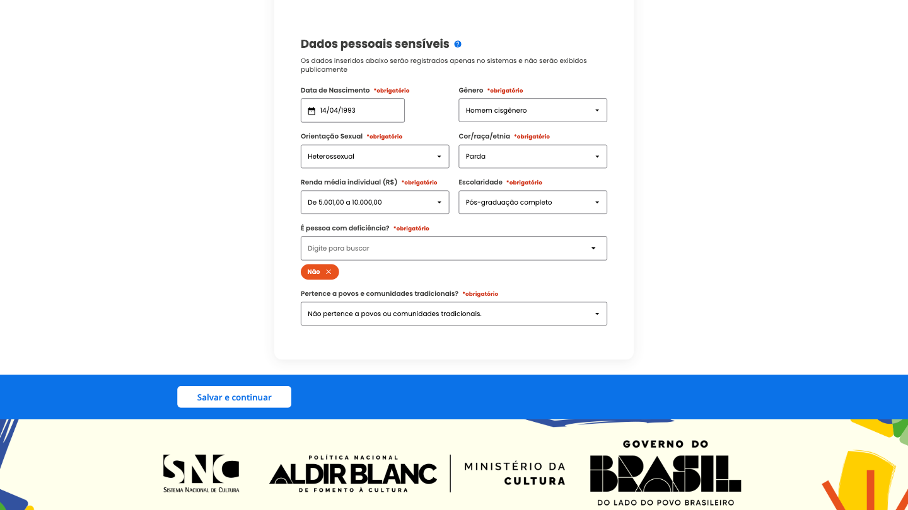

## Como criar uma conta?

Para acessar todas as funcionalidades do Cult Editais, é necessário criar uma conta com o seu login **gov.br**.

1. Clique em **Entrar**.

2. Clique em **Entrar com Gov.br**.

3. Preencha o CPF e a senha para fazer login no gov.br.

4. Preencha as informações do seu perfil.

5. Clique em **Salvar e continuar**.

---

## Edição e atualização de informações

A plataforma permite que você edite e atualize seus dados a qualquer momento pelo **Painel de Controle**, garantindo que as informações estejam sempre atualizadas.

Manter os dados atualizados é essencial para ampliar a visibilidade do seu perfil e assegurar que os gestores tenham acesso a informações corretas sobre você como proponente.

> Dica: Edite seu perfil sempre que quiser corrigir detalhes, adicionar novas informações ou ajustar datas e descrições.

---

## Painel de Controle

Para acessar o Painel de Controle, clique no menu superior, no canto direito da tela, no ícone **"Minha Conta"**.

Ao acessá-lo, você será direcionado ao painel de controle, onde pode gerenciar de forma rápida e prática todas as informações relacionadas ao seu perfil. Esse espaço permite a edição e atualização dos seus dados.

Ao clicar em **"Minha Conta"**, aparecem os atalhos do painel de controle. Ao clicar no **Painel de Controle**, você será direcionado para a página com o resumo das suas inscrições e perfis criados.

### Conta e Privacidade

Nesta seção é possível alterar informações de **e-mail e senha**.
