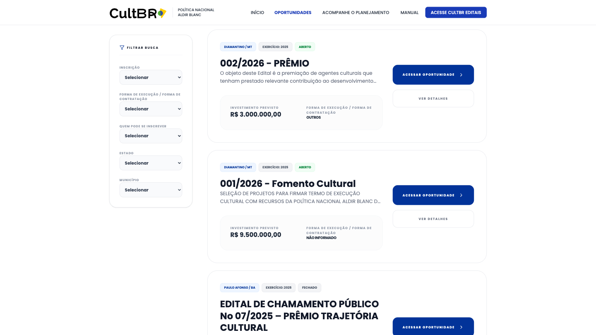
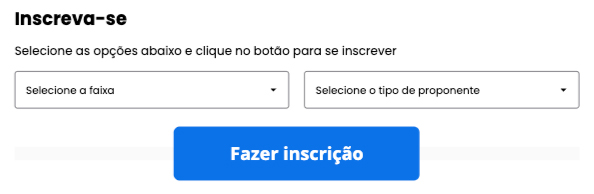
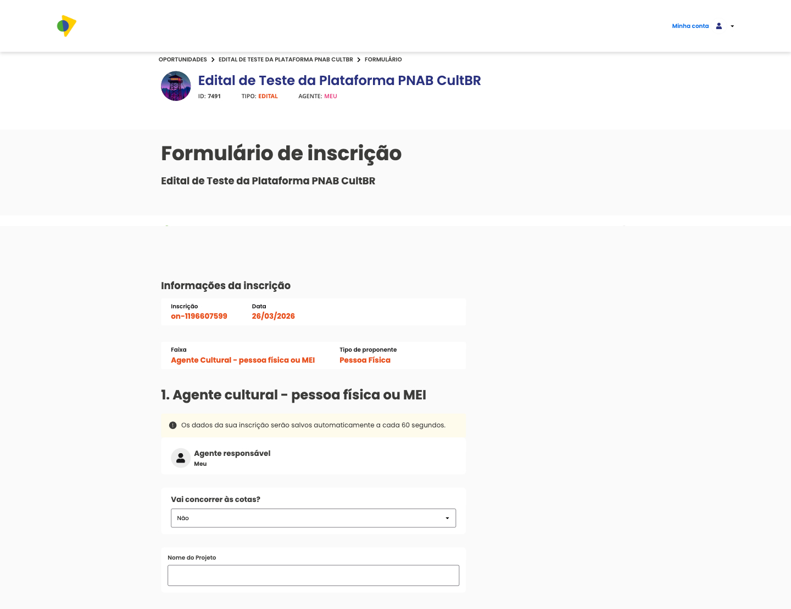
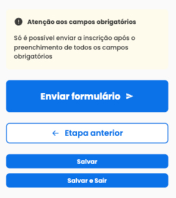
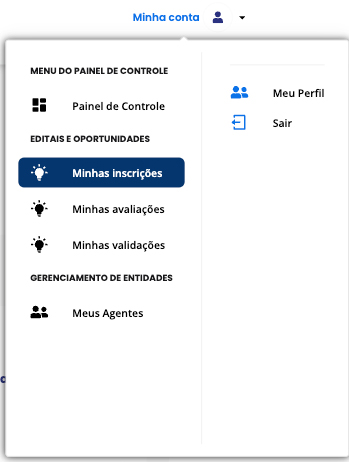
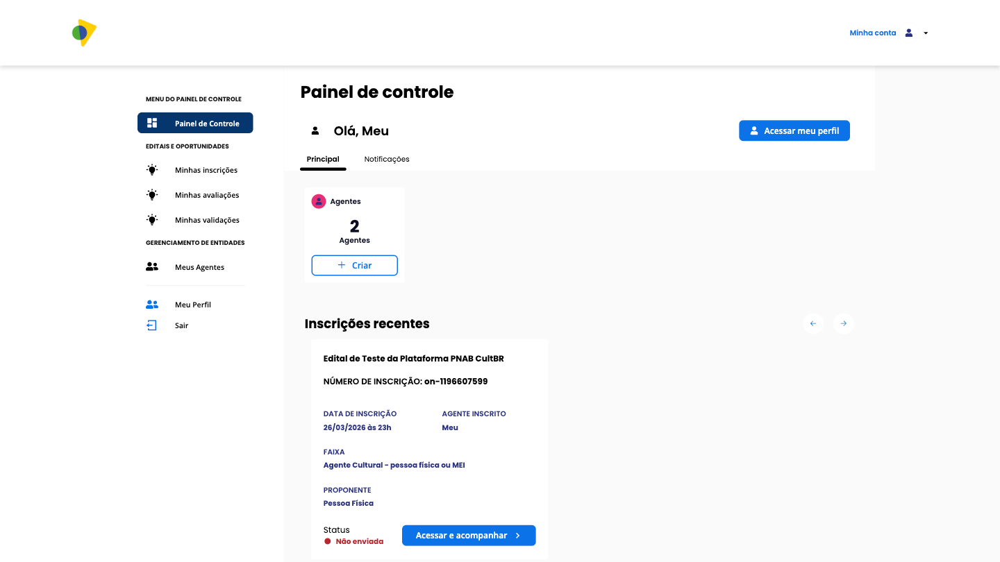
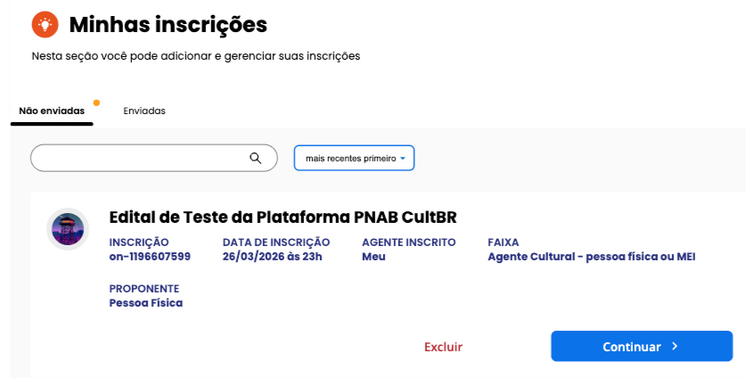

## Acessando Oportunidades Disponíveis

Na página inicial da plataforma, localize o bloco de **Editais**. Nele são exibidas as oportunidades disponíveis no momento.

Clique em **"Acesse aqui"** para ser direcionado à plataforma de editais, onde você poderá visualizar todas as chamadas públicas abertas e se inscrever na oportunidade desejada.

---

## Inscrição nas chamadas públicas

Ao acessar a plataforma de editais, você verá a listagem de oportunidades disponíveis. Para localizar a chamada pública desejada, utilize os filtros disponíveis:

- **Inscrição** — filtra pelo status ou período de inscrição
- **Forma de Execução / Forma de Contratação** — tipo de execução do projeto
- **Quem pode se inscrever** — perfil do proponente elegível
- **Estado** — unidade federativa
- **Município** — cidade de abrangência

Ao encontrar a oportunidade desejada, clique em **"Acessar oportunidade"** para ver os detalhes e iniciar sua inscrição.

---

Nesta tela você encontra todas as informações da chamada pública: descrição, período de inscrições, documentação exigida, links e anexos relevantes. Leia com atenção antes de iniciar sua candidatura para garantir que você está dentro dos critérios de participação.

> Caso não esteja logado, aparecerá o botão **"Acessar ou criar conta"**. Clique nele para fazer login ou criar sua conta antes de prosseguir. Consulte a seção [Conta](./conta) para mais detalhes.

**Passo 2 — Iniciar a Inscrição:**  

Após fazer login, a página da oportunidade exibirá as opções de **categoria** e **tipo de proponente** disponíveis para a chamada pública. Selecione as opções que correspondem ao seu perfil e clique em **"Fazer inscrição"** para prosseguir.

---

**Passo 3 — Preencher o Formulário:**  

Ao iniciar a inscrição, o sistema irá gerar automaticamente um **número de inscrição**, que será utilizado para acompanhar o andamento da sua candidatura no processo seletivo.

Dentro do formulário, preencha todos os dados solicitados de acordo com a oportunidade, a categoria e o tipo de proponente escolhidos.

---

**Passo 4 — Revisar e Enviar o Formulário:** 

> Fique atento aos campos obrigatórios do formulário de inscrição: o envio só será permitido após o preenchimento completo dessas informações.

Durante o processo, você pode utilizar os botões **"Salvar"** ou **"Salvar e Sair"** para registrar seu progresso e continuar depois, sem perder os dados inseridos.  

Se precisar revisar alguma etapa anterior, basta clicar em **"Etapa Anterior"**.  

Ao finalizar, clique em **"Enviar Formulário"** para concluir sua inscrição com sucesso.

---

**Passo 5 — Visualizar a Ficha de Inscrição:**

Após enviar a inscrição, o sistema exibirá a **ficha de inscrição** com todos os dados preenchidos. Você pode revisar as informações e, se desejar, gerar o **comprovante de inscrição**.

[imagem]

---

## Acompanhar a Situação da Inscrição

Para acompanhar a sua inscrição, você pode acessar a área de **Minhas Inscrições** de duas formas:

### Pela opção "Minha Conta"

No canto superior direito da tela, clique em **"Minha Conta"** e depois em **"Minhas Inscrições"**.

### Pelo Painel de Controle

Você também pode acessar pelo **Painel de Controle**. No menu lateral esquerdo, clique em **"Minhas Inscrições"**.

### Tela "Minhas Inscrições"

Na tela **"Minhas Inscrições"**, há duas abas para organizar o andamento das suas candidaturas.

A primeira aba, **"Não enviadas"**, reúne as inscrições que ainda estão em rascunho. Para continuar o preenchimento, basta clicar em **"Continuar"**.

Esse campo permite acompanhar o andamento da sua participação no processo seletivo. Nele são exibidos dados como:

- Número da inscrição  
- Data em que foi iniciada  
- Agente inscrito
- Faixa ou categoria escolhida  
- Tipo do proponente

**Atenção ao status "Não enviada":** isso significa que a inscrição ainda não foi finalizada e não será considerada no processo seletivo se não for enviada dentro do prazo. Verifique e conclua o envio o quanto antes!

Depois disso, você retorna ao formulário para seguir com o preenchimento, revisar os dados e concluir o envio da inscrição.

Na aba de inscrições enviadas, você poderá visualizar o status atualizado de cada candidatura, como **Enviada**, **Em Análise**, **Aprovada** ou **Indeferida**, além de conferir o número de inscrição gerado no momento do envio.

**Passo 7 — Acompanhar os resultados e recursos:**  

Por fim, fique atenta(o) aos prazos de avaliação e à divulgação dos resultados dos selecionados.  

Se a chamada pública prever uma fase de recursos, é fundamental seguir as orientações indicadas na oportunidade e realizar a contestação dentro do período estipulado, garantindo seu direito de revisão no processo seletivo.

